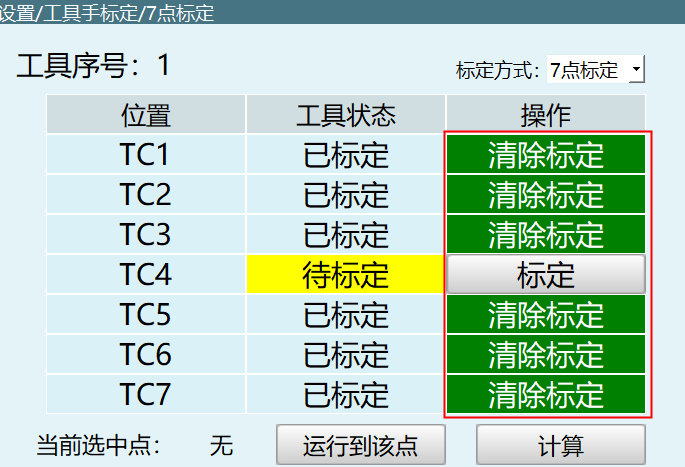
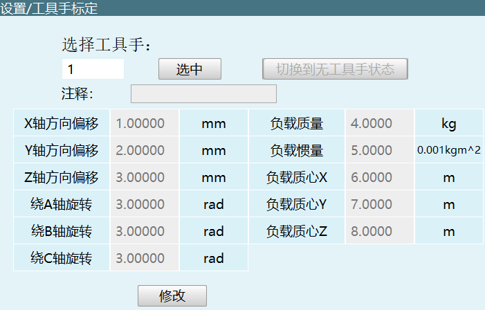
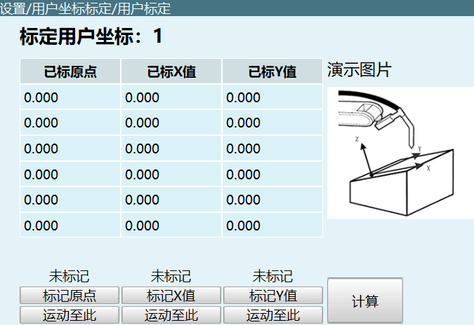
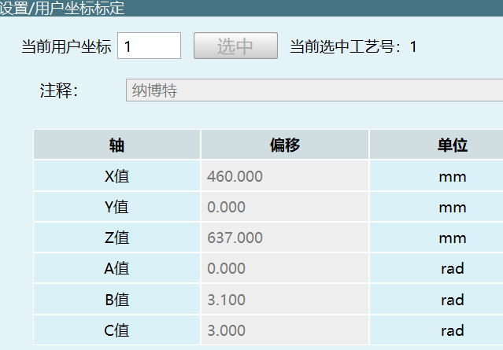

# 1.运动控制

---

## 目录

- [机器人运动](#机器人运动)
- [机器人设置](#机器人设置)
- [外部轴运动](#外部轴运动)
- [外部轴设置](#外部轴设置)
- [力学功能](#力学功能)
- [队列模式运动通讯](#队列模式运动通讯)
- [标定](#标定)
- [3D鼠标控制](#3d鼠标控制)

---

## 机器人运动

### 机器人运行状态的查询与回复

#### 示教器查询机器人的运行状态

**命令字：** `0x2304`

**请求参数：**

| 参数名 | 类型 | 必填 | 描述 |
|--------|------|------|------|
| robot | int | 是 | 选择机器人，取值范围 [1, 4] |
| jobfilename | string | 是 | 作业文件名（不包括后缀名） |
| suffix | string | 是 | 文件扩展名：.JBR主程序/.JBP后台局部程序/.JBPG后台全局程序 |

**请求示例：**

```json
{
  "robot": 1,
  "jobfilename": "AAA",
  "suffix": ".JBR"
}
```

#### 控制器回复机器人运行状态

**命令字：** `0x9103`

**响应参数：**

| 参数名 | 类型 | 描述 |
|--------|------|------|
| robot | int | 机器人编号，取值范围 [1, 4] |
| status | int | 运行状态：0-停止，1-暂停，2-运行 |
| continueRun | int | 是否存在断点执行：0/1 |
| currentRun | bool | 是否存在当前行运行：false/true |
| mainProgramRun | int | 主程序是否运行：0/1 |

**响应示例：**

```json
{
  "robot": 1,
  "status": 0,
  "continueRun": 0,
  "currentRun": false,
  "mainProgramRun": 0
}
```

---

### 机器人运动控制

#### 机器人关节运动 MOVJ

**命令字：** `0x4501`

**请求参数：**

| 参数名 | 类型 | 必填 | 描述 |
|--------|------|------|------|
| robot | int | 是 | 选择机器人，取值范围 [1, 4] |
| vel | int | 是 | 速度百分比，取值范围 [1, 100] |
| coord | int | 是 | 坐标系：0-关节坐标，1-直角坐标，2-用户坐标，3-工具坐标 |
| pos | double[7] | 是 | 目标位置，前7位为机器人本体目标位置，后5位为外部轴目标位置 |

**请求示例：**

```json
{
  "robot": 1,
  "vel": 5,
  "coord": 0,
  "pos": [1.1, 2.2, 3.3, 4.4, 5.5, 6.6, 7.7]
}
```

#### 机器人直线运动 MOVL

**命令字：** `0x4502`

**请求参数：**

| 参数名 | 类型 | 必填 | 描述 |
|--------|------|------|------|
| robot | int | 是 | 选择机器人，取值范围 [1, 4] |
| vel | int | 是 | 速度 mm/s，取值范围 [1, 1000] |
| coord | int | 是 | 坐标系：0-关节坐标，1-直角坐标，2-用户坐标，3-工具坐标 |
| pos | double[7] | 是 | 目标位置，前7位为机器人本体目标位置，后5位为外部轴目标位置 |

**请求示例：**

```json
{
  "robot": 1,
  "vel": 5,
  "coord": 0,
  "pos": [1.1, 2.2, 3.3, 4.4, 5.5, 6.6, 7.7]
}
```

#### 机器人圆弧运动 MOVC

**命令字：** `0x4503`

**请求参数：**

| 参数名 | 类型 | 必填 | 描述 |
|--------|------|------|------|
| robot | int | 是 | 选择机器人，取值范围 [1, 4] |
| vel | int | 是 | 速度 mm/s，取值范围 [1, 1000] |
| coord | int | 是 | 坐标系：0-关节坐标，1-直角坐标，2-用户坐标，3-工具坐标 |
| isFull | bool | 是 | false-MOVC，true-MOVCA |
| posOne | double[7] | 是 | 圆弧起始点，机器人本体点位 |
| posTwo | double[7] | 是 | 圆弧经过的中间点，机器人本体点位 |
| posThree | double[7] | 是 | 圆弧的目标点，机器人本体点位 |

**请求示例：**

```json
{
  "robot": 1,
  "vel": 5,
  "coord": 0,
  "isFull": false,
  "posOne": [1.1, 2.2, 3.3, 4.4, 5.5, 6.6, 7.7],
  "posTwo": [1.1, 2.2, 3.3, 4.4, 5.5, 6.6, 7.7],
  "posThree": [1.1, 2.2, 3.3, 4.4, 5.5, 6.6, 7.7]
}
```

#### 机器人样条曲线运动 MOVS

**命令字：** `0x4504`

**请求参数：**

| 参数名 | 类型 | 必填 | 描述 |
|--------|------|------|------|
| robot | int | 是 | 选择机器人，取值范围 [1, 4] |
| vel | int | 是 | 速度 mm/s，取值范围 [1, 1000] |
| coord | int | 是 | 坐标系：0-关节坐标，1-直角坐标，2-用户坐标，3-工具坐标 |
| size | int | 是 | 样条曲线的点数目，要求至少4个点位 |
| pos | double[][7] | 是 | 样条曲线的轨迹点位，二维数组 |

**请求示例：**

```json
{
  "robot": 1,
  "vel": 5,
  "coord": 0,
  "size": 4,
  "pos": [
    [1.1, 2.2, 3.3, 4.4, 5.5, 6.6, 7.7],
    [1.1, 2.2, 3.3, 4.4, 5.5, 6.6, 7.7],
    [1.1, 2.2, 3.3, 4.4, 5.5, 6.6, 7.7],
    [1.1, 2.2, 3.3, 4.4, 5.5, 6.6, 7.7]
  ]
}
```

---

### 移动到目标点位

#### 移动到目标点位

**命令字：** `0x3003` GO_POSITION

**请求参数：**

| 参数名 | 类型 | 必填 | 描述 |
|--------|------|------|------|
| robot | int | 是 | 机器人编号 |
| positionName | string | 是 | 目标点位名：SetPosition_EntrancePoint/SetPosition_AuxiliaryPoint/SetPosition_JobPoint |
| RobotPos | object | 是 | 机器人位置对象 |

**RobotPos 内部参数：**

| 参数名 | 类型 | 描述 |
|--------|------|------|
| ctype | int | 类型：NONE_TYPE=0/P_TYPE/E_TYPE/RP_TYPE/AP_TYPE/GP_TYPE/GE_TYPE |
| data | double[21] | 位置数据数组，详见下方说明 |
| key | string | 变量类型 |
| paraVarData | array | 变量数组 |

**data 数组说明：**

| 索引位置 | 描述 |
|----------|------|
| 第1、2位 | 坐标类型：0,0-关节坐标；1,1-直角坐标；2,1-工具坐标；3,1-用户坐标 |
| 第3位 | 左右手：1-左，2-右，0-无左右手（默认0） |
| 第4、5、6、7位 | 备用，默认0 |
| 第8-14位 | 机器人本体坐标值（7位）：关节坐标下为1-6轴角度值，其他坐标下为x,y,z,a,b,c |
| 第15-19位 | 外部轴坐标值（最大5个外部轴，不足补零） |

**请求示例：**

```json
{
  "robot": 1,
  "positionName": "SetPosition_JobPoint",
  "RobotPos": {
    "ctype": 0,
    "key": "",
    "data": [1.0, 1.0, 0.0, 0.0, 0.0, 0.0, 0.0, 6.0, 0.0, 6.0, 3.141590, 0.0, 0.0, 0.0, 0.0, 0.0, 0.0, 0.0, 0.0, 0.0, 0.0],
    "paraVarData": [
      {"data": 1.0, "secondvalue": 0, "value": 0, "varname": ""},
      {"data": 1.0, "secondvalue": 0, "value": 0, "varname": ""},
      {"data": 0.0, "secondvalue": 0, "value": 0, "varname": ""},
      {"data": 0.0, "secondvalue": 0, "value": 0, "varname": ""},
      {"data": 0.0, "secondvalue": 0, "value": 0, "varname": ""},
      {"data": 0.0, "secondvalue": 0, "value": 0, "varname": ""},
      {"data": 0.0, "secondvalue": 0, "value": 0, "varname": ""},
      {"data": 6.0, "secondvalue": 0, "value": 0, "varname": ""},
      {"data": 0.0, "secondvalue": 0, "value": 0, "varname": ""},
      {"data": 6.0, "secondvalue": 0, "value": 0, "varname": ""},
      {"data": 3.141590, "secondvalue": 0, "value": 0, "varname": ""},
      {"data": 0.0, "secondvalue": 0, "value": 0, "varname": ""},
      {"data": 0.0, "secondvalue": 0, "value": 0, "varname": ""},
      {"data": 0.0, "secondvalue": 0, "value": 0, "varname": ""},
      {"data": 0.0, "secondvalue": 0, "value": 0, "varname": ""},
      {"data": 0.0, "secondvalue": 0, "value": 0, "varname": ""},
      {"data": 0.0, "secondvalue": 0, "value": 0, "varname": ""},
      {"data": 0.0, "secondvalue": 0, "value": 0, "varname": ""},
      {"data": 0.0, "secondvalue": 0, "value": 0, "varname": ""},
      {"data": 0.0, "secondvalue": 0, "value": 0, "varname": ""},
      {"data": 0.0, "secondvalue": 0, "value": 0, "varname": ""}
    ]
  }
}
```

> **说明：** 程序中无对应指令

#### 运动到作业文件点位

**命令字：** `0x3005` GO_JOBFILEPOSITION

**请求参数：**

| 参数名 | 类型 | 必填 | 描述 |
|--------|------|------|------|
| robot | int | 是 | 机器人编号 |
| jobName | string | 是 | 作业文件名称 |
| suffixname | string | 是 | 作业文件后缀名（如 .JBR） |
| posName | string | 是 | 点位名称 |

**请求示例：**

```json
{
  "robot": 1,
  "jobName": "Q1",
  "suffixname": ".JBR",
  "posName": "P001"
}
```

#### 运动到用户坐标标定点位

**命令字：** `0x3006` GO_USERCALIBRATIONPOS

**请求参数：**

| 参数名 | 类型 | 必填 | 描述 |
|--------|------|------|------|
| robot | int | 是 | 机器人编号 |
| userNum | int | 是 | 用户编号 |
| posType | int | 是 | 点位类型：0-原点，1-X值，2-Y值 |

**请求示例：**

```json
{
  "robot": 1,
  "userNum": 1,
  "posType": 0
}
```

#### 运动到复位点

**命令字：** `0x3007` GO_RESET_POSITION

**请求参数：**

| 参数名 | 类型 | 必填 | 描述 |
|--------|------|------|------|
| robot | int | 是 | 机器人编号 |

**请求示例：**

```json
{
  "robot": 1
}
```

---

### 回零命令

#### 回零命令

**命令字：** `0x3002` GO_HOME

**请求参数：**

| 参数名 | 类型 | 必填 | 描述 |
|--------|------|------|------|
| robot | int | 是 | 机器人编号（1-4） |
| type | int | 是 | 回零类型：0-机器人回零，1-外部轴回零 |

**请求示例：**

```json
{
  "robot": 1,
  "type": 1
}
```

---

## 机器人设置

### 点动速度设置

#### 设置关节轴点动速度

**命令字：** `0x2604` JOG_JOINTPARAMETER_SET

**请求参数：**

| 参数名 | 类型 | 必填 | 说明 |
|--------|------|------|------|
| AxisNum | int | 是 | 关节轴编号 |
| minTrajectTime.minAccTime | float | 是 | 最小加速度时间 |
| minTrajectTime.minDecTime | float | 是 | 最小减速度时间 |
| MaxSpeed | float | 是 | 关节轴最大点动速度，单位：度°/s |
| MaxAcc | float | 是 | 关节轴点动加速度，单位：度°/s² |

**请求示例：**

```json
{
  "AxisNum": 1,
  "minTrajectTime": {
    "minAccTime": 0.10,
    "minDecTime": 0.10
  },
  "MaxSpeed": 10,
  "MaxAcc": 10
}
```

#### 查询关节轴点动速度

**发送命令字：** `0x2605` JOG_JOINTPARAMETER_INQUIRE

**请求参数：**

| 参数名 | 类型 | 必填 | 说明 |
|--------|------|------|------|
| AxisNum | int | 是 | 关节轴编号 |

**返回命令字：** `0x2606` JOG_JOINTPARAMETER_RESPOND

**响应参数：**

| 参数名 | 类型 | 说明 |
|--------|------|------|
| AxisNum | int | 关节轴编号 |
| MaxSpeed | float | 关节轴最大点动速度，单位：度°/s |
| MaxAcc | float | 关节轴点动加速度，单位：度°/s² |

**响应示例：**

```json
{
  "AxisNum": 1,
  "MaxSpeed": 10,
  "MaxAcc": 10
}
```

#### 设置直角坐标点动速度

**命令字：** `0x2607` JOG_RECTPARAMETER_SET

**请求参数：**

| 参数名 | 类型 | 必填 | 说明 |
|--------|------|------|------|
| MaxSpeed | float | 是 | 关节轴最大点动速度，单位：mm/s |
| MaxAcc | float | 是 | 关节轴点动加速度，单位：mm/s² |

**请求示例：**

```json
{
  "MaxSpeed": 10,
  "MaxAcc": 10
}
```

#### 查询直角坐标点动速度

**发送命令字：** `0x2608` JOG_RECTPARAMETER_INQUIRE

data: 空

**返回命令字：** `0x2609` JOG_RECTPARAMETER_RESPOND

**响应参数：**

| 参数名 | 类型 | 说明 |
|--------|------|------|
| MaxSpeed | float | 关节轴最大点动速度，单位：mm/s |
| MaxAcc | float | 关节轴点动加速度，单位：mm/s² |

**响应示例：**

```json
{
  "MaxSpeed": 10,
  "MaxAcc": 10
}
```

---

### 点动灵敏度设置

#### 设置点动灵敏度

**命令字：** `0x260A` JOG_SENSITIVITY_SET

**请求参数：**

| 参数名 | 类型 | 必填 | 说明 |
|--------|------|------|------|
| Sensitivity | float | 是 | 灵敏度，单位：度，范围：0.001 - 1 |

**请求示例：**

```json
{
  "Sensitivity": 0.001
}
```

#### 查询点动灵敏度

**发送命令字：** `0x260B` JOG_SENSITIVITY_INQUIRE

data: 空

**返回命令字：** `0x260C` JOG_SENSITIVITY_RESPOND

**响应参数：**

| 参数名 | 类型 | 说明 |
|--------|------|------|
| Sensitivity | float | 灵敏度，单位：度，范围：0.001 - 1 |

**响应示例：**

```json
{
  "Sensitivity": 0.001
}
```

---

### 当前位置获取

#### 坐标模式说明

| 坐标模式值 | 说明 |
|------------|------|
| -1 | 控制器当前坐标 |
| 0 | 关节坐标 (Joint) |
| 1 | 直角坐标 (Cart) |
| 2 | 工具坐标 (Tool) |
| 3 | 用户坐标 (User) |
| 4 | 电机位置 |

#### 获取当前位置

**发送命令字：** `0x2A02` CURRENTPOS_INQUIRE

**请求参数：**

| 参数名 | 类型 | 必填 | 说明 |
|--------|------|------|------|
| robot | int | 是 | 机器人编号 (1, 2, 3, 4) |
| coord | int | 是 | 坐标模式：-1-控制器当前坐标, 0-关节坐标, 1-直角坐标, 2-工具坐标, 3-用户坐标, 4-电机位置 |

**请求示例：**

```json
{
  "robot": 1,
  "coord": 2
}
```

**返回命令字：** `0x2A03` CURRENTPOS_RESPOND

**响应参数：**

| 参数名 | 类型 | 说明 |
|--------|------|------|
| robot | int | 机器人编号 (1, 2, 3, 4) |
| deg | int | 是否为ACS坐标系；0：是；1：不是 |
| pos | array | 弧度点位值，坐标值用7位存储关节坐标下。前六位为J1~J6轴角度值(度)或直角/工具/用户坐标XYZ(毫米)，四到六位为ABC坐标值(弧度)，第七位保留 |
| posDeg | array | 角度点位值，直角/工具/用户坐标下ABC弧度值转为角度值，其余状态数值与pos一致 |
| coord | int | 坐标模式：-1-控制器当前坐标, 0-关节坐标, 1-直角坐标, 2-工具坐标, 3-用户坐标, 4-电机位置 |
| configuration | int | 姿态或(SCARA)左右手 |

**响应示例：**

```json
{
  "robot": 1,
  "deg": 1,
  "pos": [0, 0.1, 2, 3.3, 44, 555.55, 0.0],
  "posDeg": [0.0, 0.0, 1, 2, 3.3, 44, 5.55],
  "coord": -1,
  "configuration": 1
}
```

#### 查询电机速度

**发送命令字：** `0x2A04` CURRENTVEL_INQUIRE

**请求参数：**

| 参数名 | 类型 | 必填 | 说明 |
|--------|------|------|------|
| robot | int | 是 | 机器人编号 (1, 2, 3, 4) |

**请求示例：**

```json
{
  "robot": 1
}
```

**返回命令字：** `0x2A05` CURRENTVEL_RESPOND

**响应参数：**

| 参数名 | 类型 | 说明 |
|--------|------|------|
| robot | int | 机器人编号 (1, 2, 3, 4) |
| vel | array | 电机速度，4轴也发六个 |
| velSync | array | 外部轴电机速度 |
| maxVel | array | 最大电机速度 |
| maxVelSync | array | 最大外部轴电机速度 |

**响应示例：**

```json
{
  "robot": 1,
  "vel": [0, 0, 0, 0, 0, 0],
  "velSync": [0, 0, 0, 0, 0],
  "maxVel": [0, 0, 0, 0, 0, 0],
  "maxVelSync": [0, 0, 0, 0, 0]
}
```

#### 查询电机扭矩

**发送命令字：** `0x2A06` CURRENTTORQ_INQUIRE

**请求参数：**

| 参数名 | 类型 | 必填 | 说明 |
|--------|------|------|------|
| robot | int | 是 | 机器人编号 (1, 2, 3, 4) |

**请求示例：**

```json
{
  "robot": 1
}
```

**返回命令字：** `0x2A07` CURRENTTORQ_RESPOND

**响应参数：**

| 参数名 | 类型 | 说明 |
|--------|------|------|
| robot | int | 机器人编号 (1, 2, 3, 4) |
| torq | array | 电机扭矩 |
| theoTorq | array | 理论电机扭矩 |
| maxTorq | array | 电机最大扭矩 |
| maxTheoTorq | array | 理论电机最大扭矩 |
| maxTorqSync | array | 外部轴电机最大扭矩 |
| torqSync | array | 外部轴电机扭矩 |

**响应示例：**

```json
{
  "robot": 1,
  "torq": [0, 0, 0, 0, 0, 0],
  "theoTorq": [0, 0, 0, 0, 0, 0],
  "maxTorq": [0, 0, 0, 0, 0, 0],
  "maxTheoTorq": [0, 0, 0, 0, 0, 0],
  "maxTorqSync": [0, 0, 0, 0, 0],
  "torqSync": [0, 0, 0, 0, 0]
}
```

---

### 运行参数设置

#### 设置运行参数

**命令字：** `0x2801` INTERPOLATION_MODE_SET

**请求参数：**

| 参数名 | 类型 | 必填 | 说明 |
|--------|------|------|------|
| absolutePosResolution | float | 是 | 绝对位置分辨率，范围：0.0001 - 0.1 度 |
| interpolationMethod | int | 是 | 机器人插补方式：0-S型, 1-梯形, 2-加加插补 |
| runDelayTime | int | 是 | 运行延时时间，范围：500 - 20000 毫秒 |
| stopTime | int | 是 | 暂停时间，范围：240 - 2000 毫秒 |

**请求示例：**

```json
{
  "absolutePosResolution": 0.010,
  "interpolationMethod": 0,
  "runDelayTime": 500,
  "stopTime": 240
}
```

#### 查询运行参数

**发送命令字：** `0x2802` INTERPOLATION_MODE_INQUIRE

data: 无

**返回命令字：** `0x2803` INTERPOLATION_MODE_RESPOND

**响应参数：**

| 参数名 | 类型 | 说明 |
|--------|------|------|
| absolutePosResolution | float | 绝对位置分辨率，单位：度 |
| interpolationMethod | int | 机器人插补方式：0-S型, 1-梯形, 2-加加插补 |
| runDelayTime | int | 运行延时时间，单位：毫秒 |
| stopTime | int | 暂停时间，单位：毫秒 |

**响应示例：**

```json
{
  "absolutePosResolution": 0.010,
  "interpolationMethod": 0,
  "runDelayTime": 500,
  "stopTime": 240
}
```

---

### 查询机器人类型、数目

#### 查询机器人类型

**发送命令字：** `0x2E02` ROBOT_TYPE_INQUIRE

data: null

**返回命令字：** `0x2E03` ROBOT_TYPE_RESPOND

**响应参数：**

| 参数名 | 类型 | 说明 |
|--------|------|------|
| type | int | 当前机器人类型 |

**响应示例：**

```json
{
  "type": 1
}
```

**机器人类型对照表：**

| 类型值 | 说明 |
|--------|------|
| 0 | 无 |
| 1 | 通用六轴串联多关节 |
| 2 | 四轴SCARA |
| 3 | 四轴码垛 |
| 4 | 四轴串联多关节 |
| 5 | 单轴 |
| 6 | 五轴串联多关节 |
| 7 | 6轴协作 |
| 8 | 二轴SCARA |
| 9 | 三轴SCARA |
| 10 | 三轴直角 |
| 11 | 三轴异形一 |
| 12 | 七轴串联多关节 |
| 13 | SCARA异形一 |
| 14 | 四轴码垛丝杆 |
| ... | 更多类型略 |

#### 查询机器人数目

**发送命令字：** `0x2E05` ROBOT_SUM_INQUIRE

data: null

**返回命令字：** `0x2E06` ROBOT_SUM_RESPOND

**响应参数：**

| 参数名 | 类型 | 说明 |
|--------|------|------|
| sum | int | 机器人数目 |

**响应示例：**

```json
{
  "sum": 1
}
```

#### 设置机器人通讯周期

**命令字：** `0x2E07` CONTROL_CYCLE_SET

**请求参数：**

| 参数名 | 类型 | 必填 | 说明 |
|--------|------|------|------|
| controlCycle | int | 是 | 通讯周期，范围：1, 2, 4, 8，控制器重启生效 |
| baudRate | string | 是 | CAN_OPEN的波特率 |

**请求示例：**

```json
{
  "controlCycle": 1,
  "baudRate": "10K"
}
```

#### 查询机器人通讯周期

**发送命令字：** `0x2E08` CONTROL_CYCLE_INQUIRE

data: null

**返回命令字：** `0x2E09` CONTROL_CYCLE_RESPOND

**响应参数：**

| 参数名 | 类型 | 说明 |
|--------|------|------|
| controlCycle | int | 通讯周期 |

**响应示例：**

```json
{
  "controlCycle": 1
}
```

#### 查询控制器功能限制情况

**发送命令字：** `0x2E0B` CONTROLLER_LIMIT_INQUIRE

data: null

**返回命令字：** `0x2E0C` CONTROLLER_LIMIT_RESPOND

**响应参数：**

| 参数名 | 类型 | 说明 |
|--------|------|------|
| robotsum | int | 机器人个数 |
| maxRobotCount | int | 机器人最大数目 |
| robottypes | object | 机器人类型解锁状态，true-已解锁, false-未解锁 |
| craft | object | 工艺解锁状态，true-已解锁, false-未解锁 |

**响应示例：**

```json
{
  "robotsum": 2,
  "maxRobotCount": 4,
  "robottypes": {
    "R_GENERAL_6S": false,
    "R_SCARA": true,
    "R_FOURAXIS_PALLET": true,
    "R_FOURAXIS": true,
    "R_GENERAL_1S": true,
    "R_GENERAL_5S": true,
    "R_GENERAL_6S_1": true,
    "R_SCARA_TWOAXIS": true,
    "R_SCARA_THREEAXIS": true,
    "R_THREE_CARTESIAN_COORDINATE": true,
    "R_THREE_CARTESIAN_COORDINATE_1": true,
    "R_GENERAL_7S": true,
    "R_SCARA_1": true,
    "R_FOURAXIS_PALLET_1": true,
    "R_FOUR_CARTESIAN_COORDINATE": true,
    "R_SIXAXIS_SPRAY_BBR": true,
    "R_FOUR_POLAR_COORDINATE_1": true,
    "R_GENERAL_6S_2": true,
    "R_GANTRY_WELD": true,
    "R_DELTA": true,
    "R_WINE_CHAMFER": true
  },
  "craft": {
    "pallet": true,
    "weld": false,
    "lasercut": true,
    "polish": true,
    "spray": true,
    "search": true,
    "pun": true,
    "vision": true
  }
}
```

---

## 外部轴运动

### 机器人外部轴关节运动 MOVJEXT

**命令字：** `0x4507`

**请求参数：**

| 参数名 | 类型 | 必填 | 说明 | 取值范围 |
|--------|------|------|------|----------|
| robot | int | 是 | 选择机器人 | [1, 4] |
| vel | int | 是 | 速度 | [1, 100]，单位：% |
| coord | int | 是 | 坐标系 | 0-关节坐标，1-直角坐标，2-用户坐标，3-工具坐标 |
| pos | double[12] | 是 | 目标位置：前7位为机器人本体目标位置，后5位为外部轴目标位置 | - |

**请求示例：**

```json
{
  "robot": 1,
  "vel": 5,
  "coord": 0,
  "pos": [1.1, 2.2, 3.3, 4.4, 5.5, 6.6, 7.7, 1.0, 2.0, 3.0, 4.0, 5.0]
}
```

---

### 机器人外部轴直线运动 MOVLEXT

**命令字：** `0x4508`

**请求参数：**

| 参数名 | 类型 | 必填 | 说明 | 取值范围 |
|--------|------|------|------|----------|
| robot | int | 是 | 选择机器人 | [1, 4] |
| vel | int | 是 | 速度 | [1, 1000]，单位：mm/s |
| coord | int | 是 | 坐标系 | 0-关节坐标，1-直角坐标，2-用户坐标，3-工具坐标 |
| pos | double[12] | 是 | 目标位置：前7位为机器人本体目标位置，后5位为外部轴目标位置 | - |

**请求示例：**

```json
{
  "robot": 1,
  "vel": 5,
  "coord": 0,
  "pos": [1.1, 2.2, 3.3, 4.4, 5.5, 6.6, 7.7, 1.0, 2.0, 3.0, 4.0, 5.0]
}
```

---

### 机器人外部轴圆弧运动 MOVCEXT

**命令字：** `0x4509`

**请求参数：**

| 参数名 | 类型 | 必填 | 说明 | 取值范围 |
|--------|------|------|------|----------|
| robot | int | 是 | 选择机器人 | [1, 4] |
| vel | int | 是 | 速度 | [1, 1000]，单位：mm/s |
| coord | int | 是 | 坐标系 | 0-关节坐标，1-直角坐标，2-用户坐标，3-工具坐标 |
| posOne | double[12] | 是 | 圆弧起始点：前7位为机器人本体目标位置，后5位为外部轴目标位置 | - |
| posTwo | double[12] | 是 | 圆弧经过的中间点：前7位为机器人本体目标位置，后5位为外部轴目标位置 | - |
| posThree | double[12] | 是 | 圆弧的目标点：前7位为机器人本体目标位置，后5位为外部轴目标位置 | - |

**请求示例：**

```json
{
  "robot": 1,
  "vel": 5,
  "coord": 0,
  "posOne": [1.1, 2.2, 3.3, 4.4, 5.5, 6.6, 7.7, 1.0, 2.0, 3.0, 4.0, 5.0],
  "posTwo": [1.1, 2.2, 3.3, 4.4, 5.5, 6.6, 7.7, 1.0, 2.0, 3.0, 4.0, 5.0],
  "posThree": [1.1, 2.2, 3.3, 4.4, 5.5, 6.6, 7.7, 1.0, 2.0, 3.0, 4.0, 5.0]
}
```

---

### 外部轴移动到目标点

**命令字：** `0x3004` (GO_SYNCPOSITION)

#### RobotPos 结构说明

| 字段 | 类型 | 说明 |
|------|------|------|
| ctype | int | P类型：NONE_TYPE=0, P_TYPE, E_TYPE, RP_TYPE, AP_TYPE, GP_TYPE, GE_TYPE |
| data | double[21] | 位置数据数组，详见下方数组索引说明 |
| key | string | 变量类型 |
| paraVarData | array | 变量数据数组 |

#### data 数组索引说明

| 索引位置 | 含义 | 说明 |
|----------|------|------|
| 0, 1 | 坐标系标识 | 0 0-关节坐标，1 1-直角坐标，2 1-工具坐标，3 1-用户坐标 |
| 2 | 左右手 | 1-左，2-右，0-无左右手（默认0） |
| 3, 4, 5, 6 | 备用 | 默认0 |
| 7 ~ 13 | 机器人本体坐标 | 7位，关节坐标下表示1-6轴角度值，其他坐标下表示x,y,z,a,b,c |
| 14 ~ 18 | 外部轴坐标 | 最大支持5个外部轴，只有关节值，不足补零 |

**请求示例：**

```json
{
  "RobotPos": {
    "ctype": 0,
    "data": [1.0, 1.0, 0.0, 0.0, 0.0, 0.0, 0.0, 6.0, 0.0, 6.0, 3.141590, 0.0, 0.0, 0.0, 0.0, 0.0, 0.0, 0.0, 0.0, 0.0, 0.0],
    "key": "",
    "paraVarData": [
      {"data": 1.0, "secondvalue": 0, "value": 0, "varname": ""},
      {"data": 1.0, "secondvalue": 0, "value": 0, "varname": ""},
      {"data": 0.0, "secondvalue": 0, "value": 0, "varname": ""},
      {"data": 0.0, "secondvalue": 0, "value": 0, "varname": ""},
      {"data": 0.0, "secondvalue": 0, "value": 0, "varname": ""},
      {"data": 0.0, "secondvalue": 0, "value": 0, "varname": ""},
      {"data": 0.0, "secondvalue": 0, "value": 0, "varname": ""},
      {"data": 6.0, "secondvalue": 0, "value": 0, "varname": ""},
      {"data": 0.0, "secondvalue": 0, "value": 0, "varname": ""},
      {"data": 6.0, "secondvalue": 0, "value": 0, "varname": ""},
      {"data": 3.141590, "secondvalue": 0, "value": 0, "varname": ""},
      {"data": 0.0, "secondvalue": 0, "value": 0, "varname": ""},
      {"data": 0.0, "secondvalue": 0, "value": 0, "varname": ""},
      {"data": 0.0, "secondvalue": 0, "value": 0, "varname": ""},
      {"data": 0.0, "secondvalue": 0, "value": 0, "varname": ""},
      {"data": 0.0, "secondvalue": 0, "value": 0, "varname": ""},
      {"data": 0.0, "secondvalue": 0, "value": 0, "varname": ""},
      {"data": 0.0, "secondvalue": 0, "value": 0, "varname": ""},
      {"data": 0.0, "secondvalue": 0, "value": 0, "varname": ""},
      {"data": 0.0, "secondvalue": 0, "value": 0, "varname": ""},
      {"data": 0.0, "secondvalue": 0, "value": 0, "varname": ""}
    ]
  },
  "robot": 1
}
```

---

## 外部轴设置

### 1. 变位机坐标校正计算设置

**命令ID:** `0x7001` SYNCPOSITIONER_CALIBRATION_SET

**说明:** 变位机坐标校正计算设置，发送如下指令

**请求参数：**

| 参数名 | 类型 | 必填 | 说明 |
|--------|------|------|------|
| calibrateNum | int | 是 | 变位机组号，可选值：1, 2, 3 |

**请求示例：**

```json
{
  "calibrateNum": 1
}
```

**控制器返回命令ID:** `0x7004` SYNCPOSITIONER_CALIBRATION_RESULT

**响应参数：**

| 参数名 | 类型 | 说明 |
|--------|------|------|
| result | bool | 外部轴数据计算是否成功 |

**响应示例：**

```json
{
  "result": true
}
```

---

### 2. 标定点坐标

**命令ID:** `0x7002` SYNCPOSITIONER_CALIBRATION_INQUIRE

**说明:** 标定点坐标，发送如下指令

**请求参数：**

| 参数名 | 类型 | 必填 | 说明 |
|--------|------|------|------|
| syncPositionerNum | int | 是 | 变位机组号，可选值：1, 2, 3 |
| pointNum | int | 是 | 取值范围：0~3 或 5 |

**请求示例：**

```json
{
  "syncPositionerNum": 1,
  "pointNum": 0
}
```

**控制器回复命令ID:** `0x7003` SYNCPOSITIONER_CALIBRATION_RESPOND

**响应参数：**

| 参数名 | 类型 | 说明 |
|--------|------|------|
| syncPositionerNum | int | 变位机组号，可选值：1, 2, 3 |
| pointNum | int | 取值范围：0~3 或 5 |
| pos | array | 当前点位 |

**响应示例：**

```json
{
  "syncPositionerNum": 1,
  "pointNum": 0,
  "pos": [0, 0, 0, 0, 0, 0]
}
```

---

### 3. 查询所有外部轴的标定结果

**命令ID:** `0x7005` SYNCPOSITIONER_TYPEANDCALIBRATIONRESULT_INQUIRE

**说明:** 查询所有外部轴的标定结果

**请求参数：**

| 参数名 | 类型 | 必填 | 说明 |
|--------|------|------|------|
| robot | int | 是 | 机器人号 |

**请求示例：**

```json
{
  "robot": 1
}
```

**返回命令ID:** `0x7006` SYNCPOSITIONER_TYPEANDCALIBRATIONRESULT_RESPOND

**响应参数：**

| 参数名 | 类型 | 说明 |
|--------|------|------|
| robot | int | 机器人号 |
| calibrateResult | array | 是否已标定，数组表示外部轴组号是否已标定 |
| syncType | array | 同步类型 |

**响应示例：**

```json
{
  "robot": 1,
  "calibrateResult": [false, false, true],
  "syncType": [1, 1, 1]
}
```

---

### 4. 标定结果查询

**命令ID:** `0x7007` SYNCPOSITIONER_COORD_INQUIRE

**说明:** 标定结果查询（示教器无此功能）

**请求参数：**

| 参数名 | 类型 | 必填 | 说明 |
|--------|------|------|------|
| syncPositionerNum | int | 是 | 变位机组号 |
| coordNum | int | 是 | 获取标定结果 |

**请求示例：**

```json
{
  "syncPositionerNum": 1,
  "coordNum": 0
}
```

**回复命令ID:** `0x7008` SYNCPOSITIONER_COORD_RESPOND

**响应参数：**

| 参数名 | 类型 | 说明 |
|--------|------|------|
| syncPositionerNum | int | 变位机组号 |
| coordNum | int | 标定结果编号 |
| pos | array | 当前点位 |

**响应示例：**

```json
{
  "syncPositionerNum": 1,
  "coordNum": 1,
  "pos": [0, 0, 0, 0, 0, 0]
}
```

---

### 5. 设置当前协作外部轴组号

**命令ID:** `0x7009` SYNCPOSITIONER_COORDNUM_SWITCH

**说明:** 设置当前协作外部轴组号

**请求参数：**

| 参数名 | 类型 | 必填 | 说明 |
|--------|------|------|------|
| curSyncPositionerNum | int | 是 | 当前协作外部轴组号 |

**请求示例：**

```json
{
  "curSyncPositionerNum": 3
}
```

**查询当前协作外部轴组号:**

**命令ID:** `0x700A` SYNCPOSITIONER_COORDNUM_INQUIRE

**说明:** 无需发送数据

**控制器回复命令ID:** `0x700B` SYNCPOSITIONER_COORDNUM_RESPOND

**响应参数：**

| 参数名 | 类型 | 说明 |
|--------|------|------|
| curSyncPositionerNum | int | 当前协作外部轴组号 |

**响应示例：**

```json
{
  "curSyncPositionerNum": 2
}
```

---

### 6. 设置地轨参数

**命令ID:** `0x700D` SYNCTRACK_SET

**说明:** 设置地轨参数，示教盒发送下面命令

**请求参数：**

| 参数名 | 类型 | 必填 | 说明 |
|--------|------|------|------|
| calibrateResult | bool | 是 | 是否协作 |
| xConversionRatio | float | 是 | x方向转换比 |
| yConversionRatio | float | 是 | y方向转换比 |
| zConversionRatio | float | 是 | z方向转换比 |

**请求示例：**

```json
{
  "calibrateResult": true,
  "xConversionRatio": 1.0,
  "yConversionRatio": 1.0,
  "zConversionRatio": 1.0
}
```

**查询命令ID:** `0x700E` SYNCTRACK_INQUIRE

**控制器回复命令ID:** `0x700F` SYNCTRACK_RESPOND

**响应示例：**

```json
{
  "calibrateResult": true,
  "xConversionRatio": 1.0,
  "yConversionRatio": 1.0,
  "zConversionRatio": 1.0
}
```

---

### 7. 当前位置查询

**命令ID:** `0x7012` SYNC_POS_INQUIRE

**说明:** 外部轴设置界面，示教盒发送下面命令

**请求参数：**

| 参数名 | 类型 | 必填 | 说明 |
|--------|------|------|------|
| robot | int | 是 | 机器人号 |
| coord | int | 是 | 坐标模式<br>- -1: 控制器当前坐标<br>- 0: 关节坐标<br>- 1: 直角坐标<br>- 2: 工具坐标<br>- 3: 用户坐标 |

**请求示例：**

```json
{
  "robot": 1,
  "coord": 0
}
```

**控制器回复命令ID:** `0x7013` SYNC_POS_RESPOND

**说明:** 复位点设置界面，控制器收到当前位置查询时发送

**响应参数：**

| 参数名 | 类型 | 说明 |
|--------|------|------|
| robot | int | 机器人号 |
| coord | int | 坐标模式<br>- -1: 控制器当前坐标<br>- 0: 关节坐标<br>- 1: 直角坐标<br>- 2: 工具坐标<br>- 3: 用户坐标 |
| configuration | int | 姿态或左右手 |
| pos | array | 当前位置（弧度制） |
| posDeg | array | 当前位置（角度制） |
| posSync | array | 外部轴当前位置 |

**响应示例：**

```json
{
  "robot": 1,
  "coord": 0,
  "configuration": 1,
  "pos": [0, 0.1, 2, 3.3, 44, 555.55, 66.6, 77.77],
  "posDeg": [0, 0.1, 2, 3.3, 44, 555.55, 66.6, 77.77],
  "posSync": [0, 0.1, 2, 3.3, 44, 555.55, 66.6, 77.77]
}
```

---

### 8. 双机协作使能

**设置双机协作使能指令命令ID:** `0x7015` COOPERATIVE_SET

**请求参数：**

| 参数名 | 类型 | 必填 | 说明 |
|--------|------|------|------|
| cooperativeRobot | int | 是 | 协作设置<br>- 0: 无协作<br>- 1: 协作 |

**请求示例：**

```json
{
  "cooperativeRobot": 0
}
```

**获取协作状态命令ID:** `0x7016` COOPERATIVE_INQUIRE

**回复协作状态命令ID:** `0x7017` COOPERATIVE_RESPOND

**响应参数：**

| 参数名 | 类型 | 说明 |
|--------|------|------|
| cooperativeRobot | int | 协作状态<br>- 0: 无协作<br>- 1: 协作 |

**响应示例：**

```json
{
  "cooperativeRobot": 0
}
```

---

### 9. 外部轴关节参数设置

**命令ID:** `0x7021` JOINTPARAMETER_SYNCPOSITIONER_SET

**说明:** 外部轴关节参数设置

#### 单轴变位机

**请求示例：**

```json
{
  "Joint": [
    {
      "BackLash": 0.0,
      "DeRatedVel": -30000.0,
      "Direction": 1.0,
      "EncoderResolution": 17.0,
      "MaxAcc": 1.0,
      "MaxDeRotSpeed": -1.0,
      "MaxDecel": -1.0,
      "MaxRotSpeed": 1.0,
      "maxJerkAcc": 1.0,
      "maxJerkDec": -1.0,
      "NegSWLimit": -360.0,
      "PosSWLimit": 720.0,
      "RatedDeRotSpeed": -5000.0,
      "RatedRotSpeed": 5000.0,
      "RatedVel": 30000.0,
      "ReducRatio": 1.0,
      "syncAxisNum": 1,
      "syncGroupNum": 1
    }
  ],
  "syncGroupNum": 1
}
```

#### 双轴变位机

**请求示例：**

```json
{
  "Joint": [
    {
      "BackLash": 0.0,
      "DeRatedVel": -18000.0,
      "Direction": 1.0,
      "EncoderResolution": 17.0,
      "MaxAcc": 1.0,
      "MaxDeRotSpeed": -1.0,
      "MaxDecel": -1.0,
      "MaxRotSpeed": 1.0,
      "NegSWLimit": -100.0,
      "PosSWLimit": 100.0,
      "RatedDeRotSpeed": -3000.0,
      "RatedRotSpeed": 3000.0,
      "RatedVel": 18000.0,
      "ReducRatio": 1.0,
      "maxJerkAcc": 1.0,
      "maxJerkDec": -1.0,
      "syncAxisNum": 1,
      "syncGroupNum": 2
    },
    {
      "BackLash": 0.0,
      "DeRatedVel": -12000.0,
      "Direction": -1.0,
      "EncoderResolution": 17.0,
      "MaxAcc": 1.0,
      "MaxDeRotSpeed": -1.0,
      "MaxDecel": -1.0,
      "MaxRotSpeed": 1.0,
      "NegSWLimit": -80.0,
      "PosSWLimit": 80.0,
      "RatedDeRotSpeed": -2000.0,
      "RatedRotSpeed": 2000.0,
      "RatedVel": 12000.0,
      "ReducRatio": 1.0,
      "maxJerkAcc": 1.0,
      "maxJerkDec": -1.0,
      "syncAxisNum": 2,
      "syncGroupNum": 2
    }
  ],
  "syncGroupNum": 2
}
```

**Joint 参数说明：**

| 参数名 | 类型 | 说明 |
|--------|------|------|
| BackLash | float | 齿轮反向间隙 |
| DeRatedVel | float | 额定负向速度 |
| Direction | float | 正反向：1.0表示正向 |
| EncoderResolution | float | 编码器分辨率（位数） |
| MaxAcc | float | 最大加速度 |
| MaxDeRotSpeed | float | 最大反转速度 |
| MaxDecel | float | 最大减速度 |
| MaxRotSpeed | float | 最大正转速度 |
| maxJerkAcc | float | 最大加加速度 |
| maxJerkDec | float | 最大减减速度 |
| NegSWLimit | float | 反向限位角度 |
| PosSWLimit | float | 正向限位角度 |
| RatedDeRotSpeed | float | 额定反转速 |
| RatedRotSpeed | float | 额定正转速 |
| RatedVel | float | 额定速度 |
| ReducRatio | float | 关节减速比 |
| syncAxisNum | int | 轴数 |
| syncGroupNum | int | 同步组号 |

**根级参数说明：**

| 参数名 | 类型 | 说明 |
|--------|------|------|
| syncGroupNum | int | 同步组号 |

**查询关节参数命令ID:** `0x7022` JOINTPARAMETER_SYNCPOSITIONER_INQUIRE

**请求参数：**

| 参数名 | 类型 | 必填 | 说明 |
|--------|------|------|------|
| syncGroupNum | int | 是 | 同步组号 |

**请求示例：**

```json
{
  "syncGroupNum": 1
}
```

**关节参数返回命令ID:** `0x7023` JOINTPARAMETER_SYNCPOSITIONER_RESPOND

**说明:** 同 0x7021

---

### 10. 外部轴点动关节速度设置

**命令ID:** `0x7024` JOG_JOINTPARAMETER_SYNCPOSITIONER_SET

**说明:** 外部轴点动关节速度设置

---

## 力学功能

### 1. 碰撞检测

#### 碰撞检测开关设置

| 字段 | 类型 | 描述 |
|------|------|------|
| 0x7406 | COLLISION_DETECTION_SET | |

**请求参数：**

| 参数名 | 类型 | 必填 | 描述 |
|--------|------|------|------|
| switch | bool | 是 | 碰撞检测开关 |

**请求示例：**

```json
{
  "switch": true
}
```

#### 获取碰撞检测开关状态

| 字段 | 类型 | 描述 |
|------|------|------|
| 0x7407 | COLLISION_DETECTION_INQUIRE | |

**请求参数：** 无

#### 控制器回复

| 字段 | 类型 | 描述 |
|------|------|------|
| 0x7408 | COLLISION_DETECTION_RESPOND | |

**响应参数：**

| 参数名 | 类型 | 描述 |
|--------|------|------|
| is_identification | bool | 辨识状态 |
| restrart_switch | bool | 重启开关 |
| switch | bool | 碰撞检测开关 |

**响应示例：**

```json
{
  "is_identification": true,
  "restrart_switch": true,
  "switch": true
}
```

#### 碰撞检测参数设置

| 字段 | 类型 | 描述 |
|------|------|------|
| 0x7409 | COLLISION_DETECTION_PARAM_SET | |

**请求参数：**

| 参数名 | 类型 | 必填 | 描述 |
|--------|------|------|------|
| Co_De_para | array[double] | 是 | 阈值，数组长度6 |
| error_enable_time | double | 是 | 误差允许时间 |
| pos_delay_time | double | 是 | 指令位置响应时间 |

**请求示例：**

```json
{
  "Co_De_para": [3.0, 4.0, 5.0, 6.0, 7.0, 8.0],
  "error_enable_time": 2.0,
  "pos_delay_time": 1.0
}
```

#### 获取碰撞检测参数

| 字段 | 类型 | 描述 |
|------|------|------|
| 0x740A | COLLISION_DETECTION_PARAM_INQUIRE | |

**请求参数：** 无

**控制器回复命令字:** `0x740B` COLLISION_DETECTION_PARAM_RESPOND

**响应参数：** 同 0x7409

---

### 2. 力矩前馈

#### 力矩前馈开关设置

| 字段 | 类型 | 描述 |
|------|------|------|
| 0x740C | TORQ_FEEDBACK_SET | |

**请求参数：**

| 参数名 | 类型 | 必填 | 描述 |
|--------|------|------|------|
| torqFeedback | bool | 是 | 力矩前馈开关 |

**请求示例：**

```json
{
  "torqFeedback": true
}
```

#### 查询力矩前馈状态

| 字段 | 类型 | 描述 |
|------|------|------|
| 0x740D | TORQ_FEEDBACK_INQUIRE | |

**请求参数：** 无

#### 控制器回复

| 字段 | 类型 | 描述 |
|------|------|------|
| 0x740E | TORQ_FEEDBACK_RESPOND | |

**响应参数：** 同 0x740C

---

### 3. 拖动示教

#### 查询拖动示教

| 字段 | 类型 | 描述 |
|------|------|------|
| 0x7501 | DRAG_TRAJ_INQUIRE | |

**请求参数：** 无

#### 控制器回复

| 字段 | 类型 | 描述 |
|------|------|------|
| 0x7502 | DRAG_TRAJ_RESPOND | |

**响应参数：**

| 参数名 | 类型 | 必填 | 描述 |
|--------|------|------|------|
| TrajName | array[string] | 是 | 轨迹名列表 |

**响应示例：**

```json
{
  "TrajName": ["RRR", "TTT"]
}
```

#### 拖动示教参数设置

| 字段 | 类型 | 描述 |
|------|------|------|
| 0x7504 | DRAG_PARAM_SET | |

**请求参数：**

| 参数名 | 类型 | 必填 | 描述 |
|--------|------|------|------|
| DecareLimit | double | 是 | 笛卡尔空间线速度限制 |
| JointVelLimit | double | 是 | 关节空间速度限制 |
| drag_mode | int | 是 | 拖动模式：0-自由拖动，1-位置拖动，2-姿态拖动 |
| frictionOffset | array[double] | 是 | 1-6关节摩擦力补偿校正系数 |
| dragCoefficient | array[double] | 是 | 关节超限阻力系数，长度6，范围[1,100] |

**请求示例：**

```json
{
  "DecareLimit": 1.0,
  "JointVelLimit": 2.0,
  "drag_mode": 0,
  "frictionOffset": [3.0, 3.0, 3.0, 3.0, 3.0, 3.0],
  "dragCoefficient": [5.0, 5.0, 5.0, 5.0, 5.0, 5.0]
}
```

#### 获取拖动示教参数

| 字段 | 类型 | 描述 |
|------|------|------|
| 0x7505 | DRAG_PARAM_INQUIRE | |

**请求参数：** 无

#### 控制器回复

| 字段 | 类型 | 描述 |
|------|------|------|
| 0x7506 | DRAG_PARAM_RESPOND | |

**响应参数：** 同 0x7504

---

### 4. 拖拽轨迹相关

#### 拖动示教轨迹回放参数设置

| 字段 | 类型 | 描述 |
|------|------|------|
| 0x7507 | DRAG_TRAJ_PARAM_SET | |

**请求参数：**

| 参数名 | 类型 | 必填 | 描述 |
|--------|------|------|------|
| MaxSamplingNum | double | 是 | 最大采样点数 |
| SamplingInterval | double | 是 | 采样间隔 |
| Start | bool | 是 | false-结束，true-开始 |

**请求示例：**

```json
{
  "MaxSamplingNum": 3000.0,
  "SamplingInterval": 0.030,
  "Start": false
}
```

#### 查询拖拽轨迹参数

| 字段 | 类型 | 描述 |
|------|------|------|
| 0x7508 | DRAG_TRAJ_PARAM_INQUIRE | |

**请求参数：** 无

#### 控制器回复

| 字段 | 类型 | 描述 |
|------|------|------|
| 0x7509 | DRAG_TRAJ_PARAM_RESPOND | |

**响应参数：** 同 0x7507

#### 查询轨迹是否被记录

| 字段 | 类型 | 描述 |
|------|------|------|
| 0x750A | DRAG_TRAJ_RECORD_INQUIRE | |

**请求参数：** 无

#### 控制器回复

| 字段 | 类型 | 描述 |
|------|------|------|
| 0x750B | DRAG_TRAJ_RECORD_RESPOND | |

**响应参数：**

| 参数名 | 类型 | 必填 | 描述 |
|--------|------|------|------|
| record | bool | 是 | 拖拽轨迹是否被记录 |

**响应示例：**

```json
{
  "record": true
}
```

#### 轨迹回放

| 字段 | 类型 | 描述 |
|------|------|------|
| 0x750C | DRAG_TRAJ_PLAYBACK | |

**请求参数：**

| 参数名 | 类型 | 必填 | 描述 |
|--------|------|------|------|
| trajName | string | 是 | 轨迹名 |
| vel | int | 是 | 轨迹回放速度，示教器固定发送100 |

**请求示例：**

```json
{
  "trajName": "",
  "vel": 100
}
```

#### 保存轨迹

| 字段 | 类型 | 描述 |
|------|------|------|
| 0x750D | DRAG_TRAJ_SAVE | |

**请求参数：**

| 参数名 | 类型 | 必填 | 描述 |
|--------|------|------|------|
| TrajName | string | 是 | 轨迹名 |

**请求示例：**

```json
{
  "TrajName": "SSSSS"
}
```

#### 删除轨迹

| 字段 | 类型 | 描述 |
|------|------|------|
| 0x750E | DRAG_TRAJ_DELETE | |

**请求参数：**

| 参数名 | 类型 | 必填 | 描述 |
|--------|------|------|------|
| TrajName | string | 是 | 轨迹名 |

**请求示例：**

```json
{
  "TrajName": "SSSSS"
}
```

#### 拖拽模式设置

| 字段 | 类型 | 描述 |
|------|------|------|
| 0x750F | DRAG_MODE | |

**请求参数：**

| 参数名 | 类型 | 必填 | 描述 |
|--------|------|------|------|
| mode | int | 是 | 拖拽模式：0-无，1-3D鼠标，2-力矩 |
| port | int | 是 | 外部触发信号端口号 |
| value | int | 是 | 外部触发信号值 |

**请求示例：**

```json
{
  "mode": 2,
  "port": 3,
  "value": 1
}
```

#### 查询拖拽模式

| 字段 | 类型 | 描述 |
|------|------|------|
| 0x7510 | DRAG_MODE_INQUIRE | |

**请求参数：** 无

#### 控制器回复

| 字段 | 类型 | 描述 |
|------|------|------|
| 0x7511 | DRAG_MODE_RESPOND | |

**响应参数：** 同 0x750F

---

### 5. 外部按键

#### 查询功能控制参数

| 字段 | 类型 | 描述 |
|------|------|------|
| 0x9114 | FUNCTIONALCONTROL_INQUIRE | |

**请求参数：** 无

#### 控制器回复

| 字段 | 类型 | 描述 |
|------|------|------|
| 0x9115 | FUNCTIONALCONTROL_RESPOND | |

> 数组下标说明：0-拖拽模式，1-点动模式，2-开始轨迹采集，3-结束轨迹采集，4-开始轨迹回放，5-上使能，6-下使能，7-夹爪开，8-夹爪关，9-保存轨迹

**响应参数：**

| 参数名 | 类型 | 必填 | 描述 |
|--------|------|------|------|
| IoInPortArr | array[int] | 是 | 触发端口(DIN)，数组长度11 |
| hardwareTypeArr | array[int] | 是 | 硬件类型：0-IO，数组长度11 |
| modeArr | array[int] | 是 | 触发方式：0-长按触发端口，1-短按触发端口，数组长度11 |
| parameterArr | array[int] | 是 | 参数：0-触发端口关闭时触发，1-触发端口打开时触发，数组长度11 |

**响应示例：**

```json
{
  "IoInPortArr": [1, 2, 3, 4, 5, 0, 6, 7, 8, 9, 10],
  "hardwareTypeArr": [0, 0, 0, 0, 0, 0, 0, 0, 0, 0, 0],
  "modeArr": [0, 0, 0, 0, 0, 0, 1, 1, 0, 0, 0],
  "parameterArr": [0, 0, 0, 0, 0, 0, 1, 1, 0, 0, 0]
}
```

#### 状态提示查询

| 字段 | 类型 | 描述 |
|------|------|------|
| 0x9116 | STATUSPROMPT_INQUIRE | |

**请求参数：** 无

#### 控制器回复

| 字段 | 类型 | 描述 |
|------|------|------|
| 0x9117 | STATUSPROMPT_RESPOND | |

> 数组下标说明：0-拖拽模式，1-点动模式，2-开始轨迹采集，3-结束轨迹采集，4-开始轨迹回放，5-上使能，6-下使能，7-夹爪开，8-夹爪关

**响应参数：**

| 参数名 | 类型 | 必填 | 描述 |
|--------|------|------|------|
| IoDoutPortArr | array[int] | 是 | 触发端口(DOUT)，数组长度11 |
| hardwareTypeArr | array[int] | 是 | 硬件类型：0-IO，数组长度11 |
| parameterArr | array[int] | 是 | 参数：0-触发端口关闭，1-触发端口打开，2-闪烁，数组长度11 |

**响应示例：**

```json
{
  "IoDoutPortArr": [1, 2, 3, 4, 5, 0, 6, 7, 0, 0, 0],
  "hardwareTypeArr": [0, 0, 0, 0, 0, 0, 0, 0, 0, 0, 0],
  "parameterArr": [0, 0, 0, 0, 0, 0, 0, 0, 0, 0, 0]
}
```

#### 设置外部按键参数

| 字段 | 类型 | 描述 |
|------|------|------|
| 0x9118 | EXTERNKEYPARA_SET | |

**请求参数：**

| 参数名 | 类型 | 必填 | 描述 |
|--------|------|------|------|
| _isFunctionalControl | bool | 是 | true-设置功能控制参数，false-设置状态提示参数 |
| hardwareTypeArr | array[int] | 是 | 硬件类型：0-IO，数组长度11 |
| isClearTrack | int | 是 | 保存后是否清除轨迹 |
| modeArr | array[int] | 是 | 触发方式：0-长按触发端口，1-短按触发端口，数组长度11 |
| parameterArr | array[int] | 是 | 参数，数组长度11 |
| portArr | array[int] | 是 | 触发端口，数组长度11 |

**请求示例：**

```json
{
  "_isFunctionalControl": true,
  "hardwareTypeArr": [0, 0, 0, 0, 0, 0, 0, 0, 0, 0, 0],
  "isClearTrack": 1,
  "modeArr": [0, 0, 0, 0, 0, 0, 0, 0, 0, 0, 0],
  "parameterArr": [0, 0, 0, 0, 0, 0, 0, 0, 0, 0, 0],
  "portArr": [1, 2, 3, 4, 5, 0, 6, 7, 8, 9, 10]
}
```

---

### 6. 动力学参数

> 动力学辨识只支持正装普通6轴，空载，辨识相关参数设置

#### 轨迹参数设置

| 字段 | 类型 | 描述 |
|------|------|------|
| 0x7601 | TRAJECTORY_PARAM_SET | |

**请求参数：**

| 参数名 | 类型 | 必填 | 描述 |
|--------|------|------|------|
| traSize | double | 是 | 轨迹范围 |
| traVel | double | 是 | 轨迹速度 |

**请求示例：**

```json
{
  "traSize": 10.0,
  "traVel": 100.0
}
```

#### 查询辨识轨迹参数

| 字段 | 类型 | 描述 |
|------|------|------|
| 0x7602 | TRAJECTORY_PARAM_INQUIRE | |

**请求参数：** 无

#### 控制器回复

| 字段 | 类型 | 描述 |
|------|------|------|
| 0x7603 | TRAJECTORY_PARAM_RESPOND | |

---

## 队列模式运动通讯

### 1. socket控制追加模式运动

#### 1.1 开启/关闭socket直接控制运动模式

开启后会进入特殊的运行模式，关闭后需要手动切回示教模式。

**消息ID:** `0x50B1` DIRECTMOTION_MODE_SET

**请求参数：**

| 参数名 | 类型 | 必填 | 说明 |
|--------|------|------|------|
| robot | number | 是 | 机器人编号（1, 2, 3, 4） |
| open | boolean | 是 | true=开启, false=关闭 |

**请求示例：**

```json
{
  "robot": 1,
  "open": true
}
```

---

#### 1.2 控制器返回开启成功/失败

**消息ID:** `0x50B3` DIRECTMOTION_MODE_RESPOND

**响应参数：**

| 参数名 | 类型 | 说明 |
|--------|------|------|
| robot | number | 机器人编号 |
| open | boolean | 当前状态 |

**响应示例：**

```json
{
  "robot": 1,
  "open": true
}
```

---

#### 1.3 发送作业文件指令队列

**消息ID:** `0x50B4` DIRECTMOTION_INSERT_INSTRVEC

**请求参数：**

| 参数名 | 类型 | 必填 | 说明 |
|--------|------|------|------|
| robot | number | 是 | 机器人编号 |
| data | array | 是 | 指令json列表 |

**data 数组元素参数：**

| 参数名 | 类型 | 必填 | 说明 |
|--------|------|------|------|
| type | number | 是 | 指令类型：1=点到，2=直线，3=圆弧，4=整圆 |
| positionId | string | 条件 | 全局点位（使用全局GP点时必填） |
| RobotPos | object | 条件 | 自定义点位（使用自动点位时必填） |
| ParaACC | object | 是 | 加速度参数 |
| ParaDEC | object | 是 | 减速度参数 |
| ParaV | object | 是 | 速度参数 |
| ParaPL | object | 是 | 平滑参数 |
| ParaTIME | object | 是 | 提前执行时间(ms) |
| ParaSPIN | object | 否 | 圆弧和整圆指令：0=姿态不变 1=六轴不转 2=六轴旋转 |
| ParaSYNC | object | 否 | 变位机是否同步 |
| imovecoord | string | 否 | 移动坐标系 |
| ctype | number | 否 | 坐标系类型 |
| length | number | 否 | 长度 |
| radius | number | 否 | 半径 |
| margin | number | 否 | 边界 |
| offsetAxis | number | 否 | 轴偏移 |
| polish | number | 否 | 打磨参数 |
| polishAngle | number | 否 | 打磨角度 |
| polishID | number | 否 | 打磨ID |
| posidname | string | 否 | 点位名称 |
| posidtype | number | 否 | 点位类型 |
| logout | boolean | 否 | 登出 |
| para | number | 否 | 预留参数 |
| side | number | 否 | 侧面 |
| userParamInt | number | 否 | 用户自定义整数 |
| userParamString | string | 否 | 用户自定义字符串 |
| width | number | 否 | 宽度 |

**ParaACC / ParaDEC / ParaV / ParaPL / ParaTIME / ParaSPIN / ParaSYNC 参数结构：**

| 参数名 | 类型 | 必填 | 说明 |
|--------|------|------|------|
| data | number | 是 | 参数值 |
| m_vUnit | number | 条件 | 速度单位（ParaV时必填）：0=cm/s 1=mm/s 2=百分比 |
| secondvalue | number | 否 | 第二值 |
| value | number | 否 | 旧版参数值 |
| varname | string | 否 | 变量名 |

**RobotPos 参数结构：**

| 参数名 | 类型 | 必填 | 说明 |
|--------|------|------|------|
| ctype | number | 是 | 坐标系类型：0-关节 1-直角 2-工具 3-用户 |
| data | array | 是 | 位置数据数组 |
| key | string | 否 | 键名 |
| paraVarData | array | 否 | 参数变量数据 |

**data 数组坐标说明（ctype 决定坐标系）：**

| 索引 | 名称 | 说明 |
|------|------|------|
| 0 | 坐标系 | 0-关节、1-直角、2-工具、3-用户 |
| 1 | 单位 | 角度-0、弧度-1 |
| 2 | 形态 | 形态值 |
| 3 | 工具工艺号 | 工具编号 |
| 4 | 用户工艺号 | 用户编号 |
| 5-6 | 预留 | 预留字段 |
| 7 | J1/X | X坐标值 |
| 8 | J2/Y | Y坐标值 |
| 9 | J3 | J3值 |
| 10 | J4 | J4值 |
| 11 | J5 | J5值 |
| 12 | J6 | J6值 |
| 13 | J7 | J7值 |
| 14-19 | 预设值 | 预设位置数据 |

---

#### 1.4 案例一：采用全局GP点

```json
{
  "data": [
    {
      "ParaACC": {"data": 25.0, "secondvalue": 0, "value": 0, "varname": ""},
      "ParaDEC": {"data": 25.0, "secondvalue": 0, "value": 0, "varname": ""},
      "ParaPL": {"data": 0.0, "secondvalue": 0, "value": 0, "varname": ""},
      "ParaSPIN": {"data": 0.0, "secondvalue": 0, "value": 0, "varname": ""},
      "ParaSYNC": {"data": 0.0, "secondvalue": 0, "value": 0, "varname": ""},
      "ParaTIME": {"data": 0.0, "secondvalue": 0, "value": 0, "varname": ""},
      "ParaV": {"data": 25.0, "m_vUnit": 2, "secondvalue": 0, "value": 0, "varname": ""},
      "ctype": 0,
      "imovecoord": "UF",
      "length": 0.0,
      "logout": false,
      "margin": 0.0,
      "offsetAxis": 0,
      "para": 0,
      "polish": 0,
      "polishAngle": 0.0,
      "polishID": 1,
      "posidname": "",
      "posidtype": 0,
      "positionId": "GP0015",
      "radius": 0.0,
      "side": 0.0,
      "type": 1,
      "userParamInt": 0,
      "userParamString": "",
      "width": 0.0
    },
    {
      "ParaACC": {"data": 100.0, "secondvalue": 0, "value": 0, "varname": ""},
      "ParaDEC": {"data": 100.0, "secondvalue": 0, "value": 0, "varname": ""},
      "ParaPL": {"data": 5.0, "secondvalue": 0, "value": 0, "varname": ""},
      "ParaSPIN": {"data": 0.0, "secondvalue": 0, "value": 0, "varname": ""},
      "ParaSYNC": {"data": 0.0, "secondvalue": 0, "value": 0, "varname": ""},
      "ParaTIME": {"data": 0.0, "secondvalue": 0, "value": 0, "varname": ""},
      "ParaV": {"data": 1000.0, "m_vUnit": 1, "secondvalue": 0, "value": 0, "varname": ""},
      "ctype": 0,
      "imovecoord": "UF",
      "length": 0.0,
      "logout": false,
      "margin": 0.0,
      "offsetAxis": 0,
      "para": 0,
      "polish": 0,
      "polishAngle": 0.0,
      "polishID": 1,
      "posidname": "",
      "posidtype": 0,
      "positionId": "GP0001",
      "radius": 0.0,
      "side": 0.0,
      "type": 2,
      "userParamInt": 0,
      "userParamString": "",
      "width": 0.0
    }
  ],
  "robot": 1
}
```

---

#### 1.5 案例二：采用自动点位

```json
{
  "data": [
    {
      "ParaACC": {"data": 10.0, "secondvalue": 0, "value": 0, "varname": ""},
      "ParaDEC": {"data": 10.0, "secondvalue": 0, "value": 0, "varname": ""},
      "ParaPL": {"data": 0.0, "secondvalue": 0, "value": 0, "varname": ""},
      "ParaSPIN": {"data": 0.0, "secondvalue": 0, "value": 0, "varname": ""},
      "ParaSYNC": {"data": 0.0, "secondvalue": 0, "value": 0, "varname": ""},
      "ParaTIME": {"data": 0.0, "secondvalue": 0, "value": 0, "varname": ""},
      "ParaV": {"data": 10.0, "m_vUnit": 2, "secondvalue": 0, "value": 0, "varname": ""},
      "RobotPos": {
        "ctype": 1,
        "data": [0.0, 0.0, 8.0, 0.0, 0.0, 0.0, 0.0, 0.999998884198, 1.999999207078, 2.999999330055, 3.999999217981, 4.999999652293, 5.999998732478, 0.0, 0.0, 0.0, 0.0, 0.0, 0.0, 0.0],
        "key": "",
        "paraVarData": [
          {"data": 0.0, "secondvalue": 0, "value": 0, "varname": ""},
          {"data": 0.0, "secondvalue": 0, "value": 0, "varname": ""},
          {"data": 8.0, "secondvalue": 0, "value": 0, "varname": ""},
          {"data": 0.0, "secondvalue": 0, "value": 0, "varname": ""},
          {"data": 0.0, "secondvalue": 0, "value": 0, "varname": ""},
          {"data": 0.0, "secondvalue": 0, "value": 0, "varname": ""},
          {"data": 0.0, "secondvalue": 0, "value": 0, "varname": ""},
          {"data": 0.999998884198, "secondvalue": 0, "value": 0, "varname": ""},
          {"data": 1.999999207078, "secondvalue": 0, "value": 0, "varname": ""},
          {"data": 2.999999330055, "secondvalue": 0, "value": 0, "varname": ""},
          {"data": 3.999999217981, "secondvalue": 0, "value": 0, "varname": ""},
          {"data": 4.999999652293, "secondvalue": 0, "value": 0, "varname": ""},
          {"data": 5.999998732478, "secondvalue": 0, "value": 0, "varname": ""},
          {"data": 0.0, "secondvalue": 0, "value": 0, "varname": ""},
          {"data": 0.0, "secondvalue": 0, "value": 0, "varname": ""},
          {"data": 0.0, "secondvalue": 0, "value": 0, "varname": ""},
          {"data": 0.0, "secondvalue": 0, "value": 0, "varname": ""},
          {"data": 0.0, "secondvalue": 0, "value": 0, "varname": ""},
          {"data": 0.0, "secondvalue": 0, "value": 0, "varname": ""},
          {"data": 0.0, "secondvalue": 0, "value": 0, "varname": ""}
        ]
      },
      "ctype": 0,
      "imovecoord": "UF",
      "length": 0.0,
      "logout": false,
      "margin": 0.0,
      "offsetAxis": 0,
      "para": 0,
      "polish": 0,
      "polishAngle": 0.0,
      "polishID": 1,
      "posidname": "",
      "posidtype": 0,
      "positionId": "",
      "radius": 0.0,
      "side": 0.0,
      "type": 1,
      "userParamInt": 0,
      "userParamString": "",
      "width": 0.0
    }
  ],
  "robot": 1
}
```

---

#### 1.6 暂停追加运行

**消息ID:** `0x50B7` DIRECTMOTION_MODE_SUSPEND

**请求参数：**

| 参数名 | 类型 | 必填 | 说明 |
|--------|------|------|------|
| robot | number | 是 | 机器人编号（1, 2, 3, 4） |

**请求示例：**

```json
{
  "robot": 1
}
```

---

#### 1.7 开始追加运行（暂停后使用）

**消息ID:** `0x50B8` DIRECTMOTION_MODE_START

**请求参数：**

| 参数名 | 类型 | 必填 | 说明 |
|--------|------|------|------|
| robot | number | 是 | 机器人编号（1, 2, 3, 4） |

**请求示例：**

```json
{
  "robot": 1
}
```

---

#### 1.8 停止追加运行

**消息ID:** `0x50B9` DIRECTMOTION_MODE_STOP

**请求参数：**

| 参数名 | 类型 | 必填 | 说明 |
|--------|------|------|------|
| robot | number | 是 | 机器人编号（1, 2, 3, 4） |

**请求示例：**

```json
{
  "robot": 1
}
```

---

#### 1.9 设置队列模式停止不下电

**消息ID:** `0x50BA`

**请求参数：**

| 参数名 | 类型 | 必填 | 说明 |
|--------|------|------|------|
| robot | number | 是 | 机器人编号（1, 2, 3, 4） |

**请求示例：**

```json
{
  "robot": 1
}
```

---

## 标定

### 工具手标定


#### 0x3801 TOOLCALIBRATION_SET

设置工具手标定

**请求参数：**

| 参数名 | 类型 | 描述 |
|--------|------|------|
| toolNum | int | 工具手号 |
| calibrationPointNum | int | 设置6点标定或7点标定 |

**请求示例：**

```json
{
  "toolNum": 2,
  "calibrationPointNum": 6
}
```

---

#### 0x3804 TOOLCALIBRATION_RESULT

标定计算完成回复

**响应参数：**

| 参数名 | 类型 | 描述 |
|--------|------|------|
| result | bool | 计算是否成功 |

**响应示例：**

```json
{
  "result": true
}
```



---

#### 0x3802 TOOLCALIBRATION_INQUIRE

查询标定点数据

**请求参数：**

| 参数名 | 类型 | 描述 |
|--------|------|------|
| pointNum | int | 下标0~6 |
| toolNum | int | 工具手号 |

**请求示例：**

```json
{
  "pointNum": 2,
  "toolNum": 1
}
```

---

#### 0x3803 TOOLCALIBRATION_RESPOND

返回标定点数据

**响应参数：**

| 参数名 | 类型 | 描述 |
|--------|------|------|
| pointNum | int | 下标0~6 |
| pos | array[6] | 位置数据 [x,y,z,rx,ry,rz] |

**响应示例：**

```json
{
  "pointNum": 2,
  "pos": [0, 0, 0, 0, 0, 0]
}
```

---

#### 0x3815 TOOL_CALIBRATION_POINTS_STATUS_INQUIRE

查询标定状态

**请求参数：**

| 参数名 | 类型 | 描述 |
|--------|------|------|
| toolNum | int | 工具手号 |

**请求示例：**

```json
{
  "toolNum": 2
}
```

---

#### 0x3816 TOOL_CALIBRATION_POINTS_STATUS_RESPOND

返回标定状态

**响应参数：**

| 参数名 | 类型 | 描述 |
|--------|------|------|
| status | array[7] | 标定状态：1=已标定，0=待标定 |

**响应示例：**

```json
{
  "status": [1, 0, 1, 0, 1, 0, 1]
}
```

---

#### 0x3817 TOOL_CALIBRATION_POINTS_STATUS_CLEAR

清除标定

**请求参数：**

| 参数名 | 类型 | 描述 |
|--------|------|------|
| pointNum | int | 下标0~6 |
| toolNum | int | 工具手号 |

**请求示例：**

```json
{
  "pointNum": 2,
  "toolNum": 1
}
```



---

#### 0x3805 TOOLPARAMETER_SET

设置工具手参数

**请求参数：**

| 参数名 | 类型 | 描述 |
|--------|------|------|
| tool.A | float | 绕A轴旋转角度 |
| tool.B | float | 绕B轴旋转角度 |
| tool.C | float | 绕C轴旋转角度 |
| tool.note | string | 注释 |
| tool.payload_inertia | float | 负载惯量 |
| tool.payload_mass | float | 负载质量 |
| tool.payload_mass_center_X | float | 负载质心X |
| tool.payload_mass_center_Y | float | 负载质心Y |
| tool.payload_mass_center_Z | float | 负载质心Z |
| tool.x | float | X轴偏移 |
| tool.y | float | Y轴偏移 |
| tool.z | float | Z轴偏移 |
| toolNum | int | 工具手号 |

**请求示例：**

```json
{
  "tool": {
    "A": 3.0,
    "B": 3.0,
    "C": 3.0,
    "note": "",
    "payload_inertia": 5.0,
    "payload_mass": 4.0,
    "payload_mass_center_X": 6.0,
    "payload_mass_center_Y": 7.0,
    "payload_mass_center_Z": 8.0,
    "x": 1.0,
    "y": 2.0,
    "z": 3.0
  },
  "toolNum": 1
}
```

---

#### 0x3806 TOOLPARAMETER_INQUIRE

查询工具手参数

**请求参数：**

| 参数名 | 类型 | 描述 |
|--------|------|------|
| toolNum | int | 工具手号 |

**请求示例：**

```json
{
  "toolNum": 2
}
```

---

#### 0x3807 TOOLPARAMETER_RESPOND

返回工具手参数

响应格式同 0x3805

---

#### 0x380A TOOLNUMBER_SWITCH

切换工具手

**请求参数：**

| 参数名 | 类型 | 描述 |
|--------|------|------|
| robot | int | 机器人编号 1-4 |
| curToolNum | int | 当前工具手号 |

**请求示例：**

```json
{
  "robot": 1,
  "curToolNum": 2
}
```

---

#### 0x380B TOOLNUMBER_INQUIRE

查询当前工具手

**请求参数：**

| 参数名 | 类型 | 描述 |
|--------|------|------|
| robot | int | 机器人编号 1-4 |

**请求示例：**

```json
{
  "robot": 1
}
```

---

#### 0x380C TOOLNUMBER_RESPOND

返回当前工具手

**响应参数：**

| 参数名 | 类型 | 描述 |
|--------|------|------|
| robot | int | 机器人编号 1-4 |
| curToolNum | int | 当前工具手号 |

**响应示例：**

```json
{
  "robot": 1,
  "curToolNum": 2
}
```

---

#### 0x3812 TOOL_CALIBRATION_POINTS_POS_INQUIRE

查询已标定点数据

**请求参数：**

| 参数名 | 类型 | 描述 |
|--------|------|------|
| pointNum | int | 下标0~6，共7个点 |
| toolNum | int | 工具手号 |

**请求示例：**

```json
{
  "pointNum": 0,
  "toolNum": 1
}
```

---

#### 0x3813 TOOL_CALIBRATION_POINTS_POS_RESPOND

返回已标定点数据

**响应参数：**

| 参数名 | 类型 | 描述 |
|--------|------|------|
| pointNum | int | 下标0~6 |
| pos | array[6] | 位置数据 [x,y,z,rx,ry,rz] |

**响应示例：**

```json
{
  "pointNum": 0,
  "pos": [0, 0, 0, 0, 0, 0]
}
```



---

### 用户坐标校正

#### 0x3C01 USERCALIBRATION_CALC

用户坐标校正设置

**请求参数：**

| 参数名 | 类型 | 描述 |
|--------|------|------|
| userNum | int | 用户坐标号 |

**请求示例：**

```json
{
  "userNum": 1
}
```

---

#### 0x3C02 USERCALIBRATION_RESULT

用户坐标校正结果返回

**响应参数：**

| 参数名 | 类型 | 描述 |
|--------|------|------|
| result | bool | true=标定成功，false=标定失败 |
| status.O | bool | O点状态 |
| status.X | bool | X点状态 |
| status.Y | bool | Y点状态 |

**响应示例：**

```json
{
  "result": true,
  "status": {
    "O": false,
    "X": false,
    "Y": false
  }
}
```

---

#### 0x3C03 USERCALIBRATION_RECORD

标记用户原点、X、Y值

**请求参数：**

| 参数名 | 类型 | 描述 |
|--------|------|------|
| userNum | int | 用户坐标号 |
| inquire | string | 取值 "O", "X", "Y" 或 "OXY" |
| posZero | array[6] | 标记原点（弧度制），当inquire为"OXY"时存在 |
| posX | array[6] | 标记X值（弧度制），当inquire为"OXY"时存在 |
| posY | array[6] | 标记Y值（弧度制），当inquire为"OXY"时存在 |

**请求示例：**

```json
{
  "userNum": 1,
  "inquire": "X",
  "posZero": [0.0, 0.0, 0.0, 0.0, 0.0, 0.0],
  "posX": [0.0, 0.0, 0.0, 0.0, 0.0, 0.0],
  "posY": [0.0, 0.0, 0.0, 0.0, 0.0, 0.0]
}
```

---

#### 0x3C04 USERCALIBRATION_RECORD_RESPOND

标记结果回复

**响应参数：**

| 参数名 | 类型 | 描述 |
|--------|------|------|
| userNum | int | 用户坐标号 |
| inquire | string | 取值 "O", "X", "Y" |
| status | bool | 状态 |
| pos | array[6] | 弧度制位置数据 |
| posDeg | array[6] | 角度制位置数据 |

**响应示例：**

```json
{
  "userNum": 1,
  "inquire": "X",
  "status": true,
  "pos": [0, 0, 0, 0, 0, 0],
  "posDeg": [0, 0, 0, 0, 0, 0]
}
```



---

#### 0x3C07 USERPARAMETER_SET

用户坐标设置

**请求参数：**

| 参数名 | 类型 | 描述 |
|--------|------|------|
| pos | array[6] | 用户坐标位置 [x,y,z,rx,ry,rz] |
| userNum | int | 用户坐标号 |

**请求示例：**

```json
{
  "pos": [460.0, 0.0, 637.0, 0.0, 3.10, 3.0],
  "userNum": 1
}
```

---

#### 0x3C08 USERPOSDATA_INQUIRE

用户坐标查询

**请求参数：**

| 参数名 | 类型 | 描述 |
|--------|------|------|
| userNum | int | 用户坐标号 |
| inquire | string | 查询类型："Calibration", "O", "X", "Y" |

**请求示例：**

```json
{
  "userNum": 1,
  "inquire": "Calibration"
}
```

---

#### 0x3C09 USERPOSDATA_RESPOND

用户坐标查询回复

**响应参数：**

| 参数名 | 类型 | 描述 |
|--------|------|------|
| userNum | int | 用户坐标号 |
| inquire | string | 查询类型 |
| status | bool | 状态 |
| pos | array[6] | 弧度制位置数据 |
| posDeg | array[6] | 角度制位置数据 |

**响应示例：**

```json
{
  "userNum": 1,
  "inquire": "Calibration",
  "status": false,
  "pos": [0, 0, 0, 0, 0, 0],
  "posDeg": [0, 0, 0, 0, 0, 0]
}
```

---

#### 0x3C0A USERCOORDINATE_SWITCH

用户坐标号设置

**请求参数：**

| 参数名 | 类型 | 描述 |
|--------|------|------|
| robot | int | 机器人编号 1-4 |
| userNum | int | 用户坐标号 |

**请求示例：**

```json
{
  "robot": 1,
  "userNum": 1
}
```

---

## 3D鼠标控制

### 设置灵敏度发送

**0x7301** THREED_MOUSE_SET

**请求参数：**

| 参数 | 类型 | 说明 |
|------|------|------|
| ABC | int | 姿态ABC |
| mouseSen | int[4] | 鼠标灵敏度xyz和姿态灵敏度（0-300） |

**请求示例：**

```json
{
  "ABC": 4,
  "mouseSen": [128, 128, 128, 128]
}
```

---

### 获取灵敏度

**0x7302** THREED_MOUSE_INQUIRE

data: 无

---

### 控制器回复

**0x7303** THREED_MOUSE_RESPOND

**响应参数：**

| 参数 | 类型 | 说明 |
|------|------|------|
| ABC | int | 姿态ABC |
| mouseSen | int[4] | 鼠标灵敏度xyz和姿态灵敏度（0-300） |

**响应示例：**

```json
{
  "ABC": 4,
  "mouseSen": [128, 128, 128, 128]
}
```

---

### 3D鼠标零点标记零点发送

**0x7304** THREED_MOUSE_SETZERO

data: 无

---

### 获取零点标记状态

**0x7305** THREED_MOUSE_SETZERO_INQUIRE

data: 无

---

### 控制器回复

**0x7306** THREED_MOUSE_SETZERO_RESPOND

**响应参数：**

| 参数 | 类型 | 说明 |
|------|------|------|
| zeroTagged | int | 0：未标记，1：已标记，2：通讯失败 |

**响应示例：**

```json
{
  "zeroTagged": 0
}
```

---

### 3D鼠标正方向标记设置

**0x7307** THREED_MOUSE_SIGN_DIRECTION

**请求参数：**

| 参数 | 类型 | 说明 |
|------|------|------|
| axis | int | 1表示标记X正方向，2：Y，3：Z |

**请求示例：**

```json
{
  "axis": 1
}
```

---

### 获取3D鼠标正方向标记状态

**0x7308** THREED_MOUSE_SIGN_DIRECTION_INQUIRE

data: 无

---

### 获取3D鼠标正方向标记状态，控制器回复

**0x7309** THREED_MOUSE_SIGN_DIRECTION_RESPOND

**响应参数：**

| 参数 | 类型 | 说明 |
|------|------|------|
| xTagged | int | X正方向 0：失败，1：成功，2：标定中 |
| yTagged | int | Y正方向 0：失败，1：成功，2：标定中 |
| zTagged | int | Z正方向 0：失败，1：成功，2：标定中 |

**响应示例：**

```json
{
  "xTagged": 0,
  "yTagged": 0,
  "zTagged": 0
}
```

---

### 退出页面时示教器发送

**0x730A** PAGE_BACK

**请求参数：**

| 参数 | 类型 | 说明 |
|------|------|------|
| pageBack | int | 3D鼠标点标记方向但未标记，直接切换界面时通知控制器退出标记方向线程 |

**请求示例：**

```json
{
  "pageBack": 1
}
```

---

### 设置3D鼠标端口号

**0x730B** THREED_MOUSE_SET_PORT

**请求参数：**

| 参数 | 类型 | 说明 | 取值范围 |
|------|------|------|----------|
| port | int | 端口号 | 1-10 |

**请求示例：**

```json
{
  "port": 1
}
```

---

### 查询3D鼠标端口号

**0x730C** THREED_MOUSE_INQUIRE_PORT

data: {}

---

### 返回查询结果

**0x730D** THREED_MOUSE_RESPOND_PORT

**响应参数：**

| 参数 | 类型 | 说明 | 取值范围 |
|------|------|------|----------|
| port | int | 端口号 | 1-10 |

**响应示例：**

```json
{
  "port": 1
}
```
