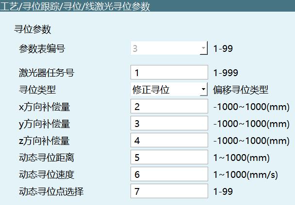
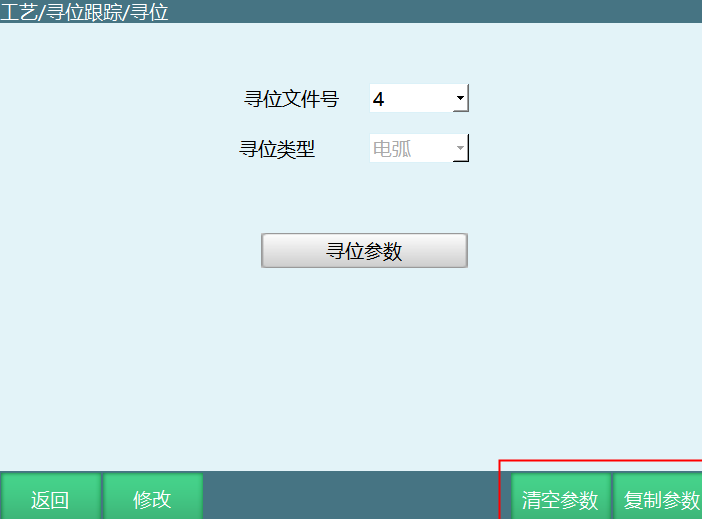
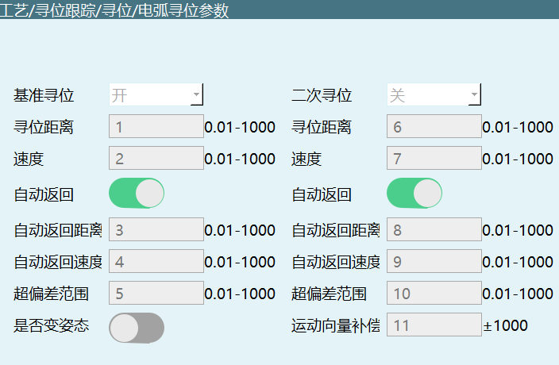

# 寻位跟踪工艺

## 设置激光器参数


设置激光器配置参数


**0x4130 TRACK_LASER_PARAM_SET**

```json
{
  "fileNum": 1,
  "laserParam": {
    "communication": 1,
    "devid": 1,
    "ip": "192.168.1.3",
    "port": 502,
    "responseTimeout": 0.3,
    "scaleFactor": 0.01,
    "timeLimit": 500.0,
    "timePeriod": 50.0,
    "vendor": "创想"
  },
  "robot": 1
}
```

| 参数名 | 类型 | 必填 | 说明 |
|--------|------|------|------|
| fileNum | int | 是 | 激光器文件号 |
| robot | int | 是 | 机器人编号 |
| laserParam.communication | int | 是 | 通讯方式：0-modbus tcp，1-ethernet tcp |
| laserParam.devid | int | 是 | 设备号 |
| laserParam.ip | string | 是 | IP地址 |
| laserParam.port | int | 是 | 端口号 |
| laserParam.responseTimeout | float | 否 | 响应超时 |
| laserParam.scaleFactor | float | 否 | 激光器放回值比例系数 |
| laserParam.timeLimit | float | 否 | 读写超时时间(ms) |
| laserParam.timePeriod | float | 否 | 读写周期(ms) |
| laserParam.vendor | string | 否 | 激光器厂家 |

---

查询激光器参数

**0x4131 TRACK_LASER_PARAM_INQUIRE**

```json
{
  "robot": 1,
  "fileNum": 1
}
```

| 参数名 | 类型 | 必填 | 说明 |
|--------|------|------|------|
| robot | int | 是 | 机器人编号 |
| fileNum | int | 是 | 激光器文件号 |

---

返回的响应激光器参数

**0x4132 TRACK_LASER_PARAM_RESPOND**

```json
{
  "fileNum": 1,
  "laserParam": {
    "commLog": false,
    "communication": 0,
    "devid": 88,
    "ip": "192.168.1.3",
    "netstate": false,
    "port": 502,
    "responseTimeout": 0.3,
    "scaleFactor": 0.01,
    "timeLimit": 500.0,
    "timePeriod": 50,
    "vendor": "创想",
    "vendorlist": [
      "通用",
      "创想",
      "锐博视",
      "睿牛",
      "同舟科技",
      "中科宏伟",
      "全视智能",
      "省工智能",
      "康普曼",
      "青东"
    ]
  },
  "robot": 1
}
```

| 参数名 | 类型 | 说明 |
|--------|------|------|
| fileNum | int | 激光器文件号 |
| robot | int | 机器人编号 |
| laserParam.commLog | bool | 通讯日志 |
| laserParam.communication | int | 通讯方式：0-modbus tcp，1-ethernet tcp |
| laserParam.devid | int | 设备号 |
| laserParam.ip | string | IP地址 |
| laserParam.netstate | bool | 网络状态 |
| laserParam.port | int | 端口号 |
| laserParam.responseTimeout | float | 响应超时 |
| laserParam.scaleFactor | float | 激光器放回值比例系数 |
| laserParam.timeLimit | float | 读写超时时间(ms) |
| laserParam.timePeriod | float | 读写周期(ms) |
| laserParam.vendor | string | 激光器厂家 |
| laserParam.vendorlist | array | 激光器厂家列表 |

---

## 激光器标定


标定记录查询

**0x4140 SENSOR_LASER_CALIBRATE_INQUIRE**

```json
{
  "robot": 1,
  "fileNum": 1
}
```

| 参数名 | 类型 | 必填 | 说明 |
|--------|------|------|------|
| robot | int | 是 | 机器人编号 |
| fileNum | int | 是 | 激光器文件号 |

---

返回0x4140查询结果

**0x4141 SENSOR_LASER_CALIBRATE_RESPOND**

```json
{
  "robot": 1,
  "fileNum": 1,
  "recordResult": {
    "point1": false,
    "point2": false,
    "point3": false,
    "point4": false,
    "point5": false,
    "point6": false,
    "point7": false
  }
}
```

| 参数名 | 类型 | 说明 |
|--------|------|------|
| robot | int | 机器人编号 |
| fileNum | int | 激光器文件号 |
| recordResult.point1~7 | bool | 各标定点记录结果 |

---

记录标定点

**0x4142 SENSOR_LASER_CALIBRATE_RECORD**

```json
{
  "robot": 1,
  "fileNum": 1,
  "pointNum": 1
}
```

| 参数名 | 类型 | 必填 | 说明 |
|--------|------|------|------|
| robot | int | 是 | 机器人编号 |
| fileNum | int | 是 | 激光器文件号 |
| pointNum | int | 是 | 标定点编号(范围1~7) |

---

查询标定结果

**0x4143 SENSOR_LASER_CALIBRATE_RECORD_RESPOND**

```json
{
  "robot": 1,
  "fileNum": 1,
  "pointNum": 1,
  "recordResult": true
}
```

| 参数名 | 类型 | 说明 |
|--------|------|------|
| robot | int | 机器人编号 |
| fileNum | int | 激光器文件号 |
| pointNum | int | 标定点编号 |
| recordResult | bool | 记录结果 |

---

运动到标定点

**0x4144 SENSOR_LASER_CALIBRATE_MOVETO**

```json
{
  "robot": 1,
  "fileNum": 1,
  "pointNum": 1
}
```

| 参数名 | 类型 | 必填 | 说明 |
|--------|------|------|------|
| robot | int | 是 | 机器人编号 |
| fileNum | int | 是 | 激光器文件号 |
| pointNum | int | 是 | 标定点编号 |

---

计算标定结果

**0x4145 SENSOR_LASER_CALIBRATE_CALCULATE**

```json
{
  "robot": 1,
  "fileNum": 1
}
```

| 参数名 | 类型 | 必填 | 说明 |
|--------|------|------|------|
| robot | int | 是 | 机器人编号 |
| fileNum | int | 是 | 激光器文件号 |

---

返回0x4145计算结果

**0x4146 SENSOR_LASER_CALIBRATE_CALCULATE_RESPOND**

```json
{
  "robot": 1,
  "fileNum": 1,
  "result": true
}
```

| 参数名 | 类型 | 说明 |
|--------|------|------|
| robot | int | 机器人编号 |
| fileNum | int | 激光器文件号 |
| result | bool | 计算结果 |

---

清空标定记录

**0x4147 SENSOR_LASER_CALIBRATE_CLEAR**

```json
{
  "robot": 1,
  "fileNum": 1
}
```

| 参数名 | 类型 | 必填 | 说明 |
|--------|------|------|------|
| robot | int | 是 | 机器人编号 |
| fileNum | int | 是 | 激光器文件号 |

返回0x4141

---

取消标定

**0x4148 SENSOR_LASER_CALIBRATE_CANCEL**

```json
{
  "robot": 1,
  "fileNum": 1
}
```

| 参数名 | 类型 | 必填 | 说明 |
|--------|------|------|------|
| robot | int | 是 | 机器人编号 |
| fileNum | int | 是 | 激光器文件号 |

---

查询激光器是否标定

**0x4149 SENSOR_LASER_CALIBRATE_RESULT_INQUIRE**

```json
{
  "robot": 1,
  "fileNum": 1
}
```

| 参数名 | 类型 | 必填 | 说明 |
|--------|------|------|------|
| robot | int | 是 | 机器人编号 |
| fileNum | int | 是 | 激光器文件号 |

---

响应0x4149查询结果

**0x414A SENSOR_LASER_CALIBRATE_RESULT_RESPOND**

```json
{
  "robot": 1,
  "fileNum": 1,
  "laserCalibrated": false
}
```

| 参数名 | 类型 | 说明 |
|--------|------|------|
| robot | int | 机器人编号 |
| fileNum | int | 激光器文件号 |
| laserCalibrated | bool | 是否已标定 |

---

## 设置寻位类型


**0x4133 LOCATING_SENSORTYPE_SET**

```json
{
  "fileNum": 77,
  "robot": 1,
  "sensorType": 0
}
```

| 参数名 | 类型 | 必填 | 说明 |
|--------|------|------|------|
| fileNum | int | 是 | 激光器文件号 |
| robot | int | 是 | 机器人编号 |
| sensorType | int | 是 | 寻位类型：0-线激光，1-电弧 |

---

查询寻位类型

**0x4134 LOCATING_SENSORTYPE_INQUIRE**

```json
{
  "robot": 1,
  "fileNum": 1
}
```

| 参数名 | 类型 | 必填 | 说明 |
|--------|------|------|------|
| robot | int | 是 | 机器人编号 |
| fileNum | int | 是 | 激光器文件号 |

---

响应寻位类型

**0x4135 LOCATING_SENSORTYPE_RESPOND**

```json
{
  "robot": 1,
  "fileNum": 1,
  "sensorType": 0
}
```

| 参数名 | 类型 | 说明 |
|--------|------|------|
| robot | int | 机器人编号 |
| fileNum | int | 激光器文件号 |
| sensorType | int | 寻位类型：0-线激光，1-电弧 |

---

## 设置跟踪类型


**0x4169 TRACK_SENSORTYPE_SET**

```json
{
  "robot": 1,
  "fileNum": 1,
  "sensorType": 0
}
```

| 参数名 | 类型 | 必填 | 说明 |
|--------|------|------|------|
| robot | int | 是 | 机器人编号 |
| fileNum | int | 是 | 激光器文件号 |
| sensorType | int | 是 | 跟踪类型：0-线激光，1-电弧，2-弧压 |

---

查询跟踪类型

**0x4170 TRACK_SENSORTYPE_INQUIRE**

```json
{
  "robot": 1,
  "fileNum": 1
}
```

| 参数名 | 类型 | 必填 | 说明 |
|--------|------|------|------|
| robot | int | 是 | 机器人编号 |
| fileNum | int | 是 | 激光器文件号 |

---

返回0x4170查询结果

**0x4171 TRACK_SENSORTYPE_RESPOND**

同0x4169

---

## 设置激光跟踪参数表


**0x4136 TRACK_LASER_TRACKPARAM_SET**

```json
{
  "fileNum": 1,
  "robot": 1,
  "tableid": 98,
  "trackParam": {
    "compensateX": 1.0,
    "compensateY": 2.0,
    "compensateZ": 3.0,
    "din_end": 0,
    "dout_part_move": -1,
    "endPoint": {
      "interval": 6.0,
      "scanPeriod": 5.0
    },
    "filter": {
      "level": 4,
      "type": 1
    },
    "laserTaskId": 7,
    "positionHold": {
      "distance": 100.0,
      "switchon": false
    },
    "scanErrorLength": 8.0,
    "sensitivity": 3,
    "trackMode": 0
  }
}
```

| 参数名 | 类型 | 必填 | 说明 |
|--------|------|------|------|
| fileNum | int | 是 | 激光器文件号 |
| robot | int | 是 | 机器人编号 |
| tableid | int | 是 | 跟踪模式 |
| trackParam.compensateX | float | 否 | x方向补偿量 |
| trackParam.compensateY | float | 否 | y方向补偿量 |
| trackParam.compensateZ | float | 否 | z方向补偿量 |
| trackParam.din_end | int | 否 | 跟踪结束输入IO |
| trackParam.dout_part_move | int | 否 | 工件旋转输出IO |
| trackParam.endPoint.interval | float | 否 | 结束点扫描区间 |
| trackParam.endPoint.scanPeriod | float | 否 | 结束点扫描周期 |
| trackParam.filter.level | int | 否 | 滤波等级 |
| trackParam.filter.type | int | 否 | 滤波方式：0-无，1-滑动平均滤波 |
| trackParam.laserTaskId | int | 否 | 激光器任务号 |
| trackParam.positionHold.distance | float | 否 | 寻位保持触发距离 |
| trackParam.positionHold.switchon | bool | 否 | 寻位保存功能：true开启，false关闭 |
| trackParam.scanErrorLength | float | 否 | 扫描错误确认距离 |
| trackParam.sensitivity | int | 否 | 灵敏度 |
| trackParam.trackMode | int | 否 | 跟踪模式：0-绝对式，1-定点增量式，2-行走增量式 |

---

查询激光跟踪参数

**0x4137 TRACK_LASER_TRACKPARAM_INQUIRE**

```json
{
  "robot": 1,
  "fileNum": 1,
  "tableid": 1
}
```

| 参数名 | 类型 | 必填 | 说明 |
|--------|------|------|------|
| robot | int | 是 | 机器人编号 |
| fileNum | int | 是 | 激光器文件号 |
| tableid | int | 是 | 参数表编号 |

---

响应激光跟踪参数

**0x4138 TRACK_LASER_TRACKPARAM_RESPOND**

Data：同0x4136

---

## 寻位参数表



设置寻位参数

**0x4139 TRACK_LASER_SEARCHPARAM_SET**

```json
{
  "fileNum": 1,
  "robot": 1,
  "searchParam": {
    "compensateX": 2.0,
    "compensateY": 3.0,
    "compensateZ": 4.0,
    "dynamic": {
      "distance": 5.0,
      "pointIndex": 7,
      "speed": 6.0
    },
    "laserTaskId": 1,
    "storeType": 1
  },
  "tableid": 3
}
```

| 参数名 | 类型 | 必填 | 说明 |
|--------|------|------|------|
| fileNum | int | 是 | 寻位文件号 |
| robot | int | 是 | 机器人编号 |
| tableid | int | 是 | 参数表编号 |
| searchParam.compensateX | float | 否 | x方向补偿量 |
| searchParam.compensateY | float | 否 | y方向补偿量 |
| searchParam.compensateZ | float | 否 | z方向补偿量 |
| searchParam.dynamic.distance | float | 否 | 动态寻位距离 |
| searchParam.dynamic.pointIndex | int | 否 | 动态寻位选择 |
| searchParam.dynamic.speed | float | 否 | 动态寻位速度 |
| searchParam.laserTaskId | int | 否 | 激光器任务号 |
| searchParam.storeType | int | 否 | 寻位类型：0-基准寻位，1-修正寻位 |

---

查询寻位参数

**0x413A TRACK_LASER_SEARCHPARAM_INQUIRE**

```json
{
  "robot": 1,
  "fileNum": 1,
  "tableid": 1
}
```

| 参数名 | 类型 | 必填 | 说明 |
|--------|------|------|------|
| robot | int | 是 | 机器人编号 |
| fileNum | int | 是 | 激光器文件号 |
| tableid | int | 是 | 参数表编号 |

---

回复寻位参数

**0x413B TRACK_LASER_SEARCHPARAM_RESPOND**

Data：同0x4139

---



复制寻位参数（复制前要0x413D清空）

**0x413C TRACK_SEAMTRACK_PARAM_COPY**

```json
{
  "dstFileNum": 4,
  "fileNum": 1,
  "function": 1,
  "robot": 1,
  "sensorType": 0
}
```

| 参数名 | 类型 | 必填 | 说明 |
|--------|------|------|------|
| dstFileNum | int | 是 | 复制到的文件号 |
| fileNum | int | 是 | 复制的文件号 |
| function | int | 是 | 0-跟踪，1-寻位 |
| robot | int | 是 | 机器人编号 |
| sensorType | int | 是 | 跟踪类型：0-线激光，1-电弧，2-弧压；寻位类型：0-线激光，1-电弧 |

---

清空寻位参数

**0x413D TRACK_SEAMTRACK_PARAM_CLEAR**

```json
{
  "robot": 1,
  "fileNum": 1,
  "sensorType": 0,
  "function": 0
}
```

| 参数名 | 类型 | 必填 | 说明 |
|--------|------|------|------|
| robot | int | 是 | 机器人编号 |
| fileNum | int | 是 | 激光器文件号 |
| sensorType | int | 是 | 跟踪类型：0-线激光，1-电弧，2-弧压；寻位类型：0-线激光，1-电弧 |
| function | int | 是 | 0-跟踪，1-寻位 |

> 注：清空完成，要查询一次参数

---

## 电弧跟踪


设置通讯参数


**0x4150 TRACK_ARC_COMMPARAM_SET**

```json
{
  "robot": 1,
  "craftid": 1,
  "sampling": {
    "dataType": 0,
    "period": 20
  }
}
```

| 参数名 | 类型 | 必填 | 说明 |
|--------|------|------|------|
| robot | int | 是 | 机器人编号 |
| craftid | int | 是 | 跟踪文件号 |
| sampling.dataType | int | 是 | 数据类型：0-电流，1-电压 |
| sampling.period | int | 是 | 采样周期(0~1000) |

---

查询通讯参数

**0x4151 TRACK_ARC_COMMPARAM_INQUIRE**

```json
{
  "robot": 1,
  "craftid": 1
}
```

| 参数名 | 类型 | 必填 | 说明 |
|--------|------|------|------|
| robot | int | 是 | 机器人编号 |
| craftid | int | 是 | 跟踪文件号 |

---

响应通讯参数查询

**0x4152 TRACK_ARC_COMMPARAM_RESPOND**

```json
{
  "robot": 1,
  "craftid": 1,
  "sampling": {
    "dataType": 0,
    "period": 20
  }
}
```

| 参数名 | 类型 | 说明 |
|--------|------|------|
| robot | int | 机器人编号 |
| craftid | int | 跟踪文件号 |
| sampling.dataType | int | 数据类型：0-电流，1-电压 |
| sampling.period | int | 采样周期(0~1000) |

---

设置左右补偿参数


**0x4153 TRACK_ARC_LATERALCOMPENPARAM_SET**

```json
{
  "craftid": 1,
  "robot": 1,
  "lateralCompensation": {
    "accFactor": 5.0,
    "algorithmType": 0,
    "beginCycleNum": 1,
    "factor": 2.0,
    "maxSingleLen": 4.0,
    "switchon": false,
    "threshold": 3.0
  }
}
```

| 参数名 | 类型 | 必填 | 说明 |
|--------|------|------|------|
| craftid | int | 是 | 跟踪文件号 |
| robot | int | 是 | 机器人编号 |
| lateralCompensation.accFactor | float | 否 | 补偿加速度倍数(0.1~10) |
| lateralCompensation.algorithmType | int | 否 | 偏差提取类型：0-均值 |
| lateralCompensation.beginCycleNum | int | 否 | 开始采样周期数(1~1000) |
| lateralCompensation.factor | float | 否 | 纠偏因数(0.001~1000) |
| lateralCompensation.maxSingleLen | float | 否 | 每次最大补偿量(0~10) |
| lateralCompensation.switchon | bool | 否 | 补偿开关 |
| lateralCompensation.threshold | float | 否 | 补偿阈值(0~1000) |

---

查询左右补偿参数

**0x4154 TRACK_ARC_LATERALCOMPENPARAM_INQUIRE**

```json
{
  "robot": 1,
  "craftid": 1
}
```

| 参数名 | 类型 | 必填 | 说明 |
|--------|------|------|------|
| robot | int | 是 | 机器人编号 |
| craftid | int | 是 | 跟踪文件号 |

---

返回左右参数查询

**0x4155 TRACK_ARC_LATERALCOMPENPARAM_RESPOND**

同：0x4153

---

设置高低补偿参数


**0x4156 TRACK_ARC_VERTICALCOMPENPARAM_SET**

```json
{
  "craftid": 1,
  "robot": 1,
  "verticalCompensation": {
    "accFactor": 1,
    "algorithmType": 0,
    "beginCycleNum": 5,
    "factor": 4,
    "maxSingleLen": 2,
    "switchon": true,
    "threshold": 3
  }
}
```

| 参数名 | 类型 | 必填 | 说明 |
|--------|------|------|------|
| craftid | int | 是 | 跟踪文件号 |
| robot | int | 是 | 机器人编号 |
| verticalCompensation.accFactor | float | 否 | 补偿加速度倍数 |
| verticalCompensation.algorithmType | int | 否 | 偏差提取类型 |
| verticalCompensation.beginCycleNum | int | 否 | 开始采集周期数 |
| verticalCompensation.factor | float | 否 | 纠偏因数 |
| verticalCompensation.maxSingleLen | float | 否 | 每次最大补偿量 |
| verticalCompensation.switchon | bool | 否 | 补偿开关 |
| verticalCompensation.threshold | float | 否 | 补偿阈值 |

---

查询高低补偿参数

**0x4157 TRACK_ARC_VERTICALCOMPENPARAM_INQUIRE**

```json
{
  "robot": 1,
  "craftid": 1
}
```

| 参数名 | 类型 | 必填 | 说明 |
|--------|------|------|------|
| robot | int | 是 | 机器人编号 |
| craftid | int | 是 | 跟踪文件号 |

---

返回高低补偿参数查询

**0x4158 TRACK_ARC_VERTICALCOMPENPARAM_RESPOND**

同：0x4156

---

## 触摸寻位参数



**0x4160 SEARCH_TOUCH_PARAM_SET**

```json
{
  "craftid": 1,
  "robot": 1,
  "touchSearch": {
    "2ndAutoDistance": 8.0,
    "2ndAutoReturn": true,
    "2ndAutoVel": 9.0,
    "2ndDeviationLimit": 10.0,
    "2ndDistance": 6.0,
    "2ndSwitchon": false,
    "2ndVel": 7.0,
    "autoDistance": 3.0,
    "autoReturn": true,
    "autoVel": 4.0,
    "baseFlag": true,
    "compensation": 11.0,
    "deviationLimit": 5.0,
    "distance": 1.0,
    "isChangePose": false,
    "vel": 2.0
  }
}
```

| 参数名 | 类型 | 必填 | 说明 |
|--------|------|------|------|
| craftid | int | 是 | 寻位文件号 |
| robot | int | 是 | 机器人编号 |
| touchSearch.2ndAutoDistance | float | 否 | 二次自动返回距离 |
| touchSearch.2ndAutoReturn | bool | 否 | 二次自动返回使能 |
| touchSearch.2ndAutoVel | float | 否 | 二次自动返回速度 |
| touchSearch.2ndDeviationLimit | float | 否 | 二次超偏差范围 |
| touchSearch.2ndDistance | float | 否 | 二次寻位距离 |
| touchSearch.2ndSwitchon | bool | 否 | 二次寻位使能 |
| touchSearch.2ndVel | float | 否 | 二次寻位速度 |
| touchSearch.autoDistance | float | 否 | 自动返回距离 |
| touchSearch.autoReturn | bool | 否 | 自动返回使能 |
| touchSearch.autoVel | float | 否 | 自动返回速度 |
| touchSearch.baseFlag | bool | 否 | 基准寻位开关 |
| touchSearch.compensation | float | 否 | 运动向量补偿 |
| touchSearch.deviationLimit | float | 否 | 超偏差范围 |
| touchSearch.distance | float | 否 | 寻位距离 |
| touchSearch.isChangePose | bool | 否 | 是否变姿态 |
| touchSearch.vel | float | 否 | 寻位速度 |

---

查询参数

**0x4161 SEARCH_TOUCH_PARAM_INQUIRE**

```json
{
  "robot": 1,
  "craftid": 1
}
```

| 参数名 | 类型 | 必填 | 说明 |
|--------|------|------|------|
| robot | int | 是 | 机器人编号 |
| craftid | int | 是 | 寻位文件号 |

---

响应查询

**0x4162 SEARCH_TOUCH_PARAM_RESPOND**

参数同0x4160

---

## 弧压追踪


弧压跟踪参数设置

**0x4163 ARC_VOLTAGE_TRACK_PARAMETERS_SET**

```json
{
  "base_calc": {
    "collect_time": 5.0,
    "method": 0,
    "vol_inc": 4.0,
    "voltage": 3.0
  },
  "collection": {
    "analog_port": 1,
    "equipment": 0,
    "invalid_data_time": 2.0,
    "period": 1
  },
  "craftid": 1,
  "pid": {
    "dev_shreshold": 9.0,
    "kd": 8.0,
    "ki": 7.0,
    "kp": 6.0,
    "max_iout": 10.0,
    "max_out": 11.0
  },
  "robot": 1
}
```

| 参数名 | 类型 | 必填 | 说明 |
|--------|------|------|------|
| craftid | int | 是 | 跟踪文件号 |
| robot | int | 是 | 机器人编号 |
| base_calc.collect_time | float | 否 | 焊接开始计算时间(s) |
| base_calc.method | int | 否 | 基准电压获取方式：0-焊接计算，1-手动计算 |
| base_calc.vol_inc | float | 否 | 计算增量 |
| base_calc.voltage | float | 否 | 基准电压(=计算量+计算增量) |
| collection.analog_port | int | 否 | 弧压采集模拟端口(AIN-1...) |
| collection.equipment | int | 否 | 弧压采集设备：0-焊机，1-弧压模块 |
| collection.invalid_data_time | float | 否 | 无效数据时间(s) |
| collection.period | int | 否 | 采样周期(ms) |
| pid.dev_shreshold | float | 否 | 偏差阈值 |
| pid.kd | float | 否 | 微分系数 |
| pid.ki | float | 否 | 积分系数 |
| pid.kp | float | 否 | 比例系数 |
| pid.max_iout | float | 否 | 积分限幅 |
| pid.max_out | float | 否 | 输出限幅 |

---

弧压跟踪参数查询

**0x4164 ARC_VOLTAGE_TRACK_PARAMETERS_INQUIRE**

```json
{
  "robot": 1,
  "craftid": 1
}
```

| 参数名 | 类型 | 必填 | 说明 |
|--------|------|------|------|
| robot | int | 是 | 机器人编号 |
| craftid | int | 是 | 跟踪文件号 |

---

响应弧压跟踪参数查询

**0x4165 ARC_VOLTAGE_TRACK_PARAMETERS_RESPOND**

同：0x4163

---

弧压跟踪基准电压计算开启

**0x4166 ARC_VOLTAGE_TRACK_BASEVOLTAGE_CALC_START**

```json
{
  "robot": 1,
  "craftid": 1
}
```

| 参数名 | 类型 | 必填 | 说明 |
|--------|------|------|------|
| robot | int | 是 | 机器人编号 |
| craftid | int | 是 | 跟踪文件号 |

---

弧压跟踪基准电压计算关闭

**0x4167 ARC_VOLTAGE_TRACK_BASEVOLTAGE_CALC_END**

```json
{
  "robot": 1,
  "craftid": 1
}
```

| 参数名 | 类型 | 必填 | 说明 |
|--------|------|------|------|
| robot | int | 是 | 机器人编号 |
| craftid | int | 是 | 跟踪文件号 |

---

计算弧压跟踪基准电压

**0x4168 ARC_VOLTAGE_TRACK_BASEVOLTAGE_CALC**

```json
{
  "robot": 1,
  "craftid": 1
}
```

| 参数名 | 类型 | 必填 | 说明 |
|--------|------|------|------|
| robot | int | 是 | 机器人编号 |
| craftid | int | 是 | 跟踪文件号 |

---

返回0x4168计算结果

**ARC_VOLTAGE_TRACK_BASEVOLTAGE_CALCURESULTS_GET**

```json
{
  "basic_calc": {
    "voltage": 0.0
  }
}
```

| 参数名 | 类型 | 说明 |
|--------|------|------|
| basic_calc.voltage | float | 基准电压 |

---

修改弧压跟踪小窗参数

**0x416B ARC_VOLTAGE_TRACK_WINDOWSPARAM_SET**

```json
{
  "base_calc": {
    "vol_inc": 4.0,
    "voltage": 3.0
  },
  "craftid": 3,
  "robot": 1
}
```

| 参数名 | 类型 | 必填 | 说明 |
|--------|------|------|------|
| robot | int | 是 | 机器人编号 |
| craftid | int | 是 | 跟踪文件号 |
| base_calc.vol_inc | float | 否 | 计算增量 |
| base_calc.voltage | float | 否 | 基准电压 |
