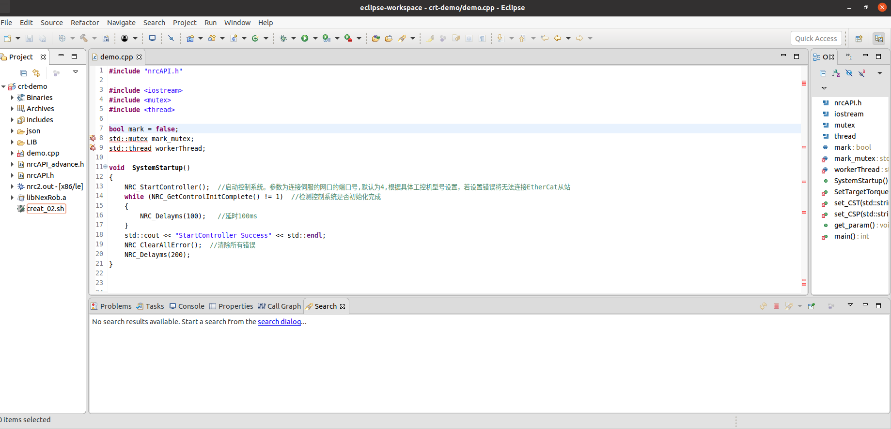
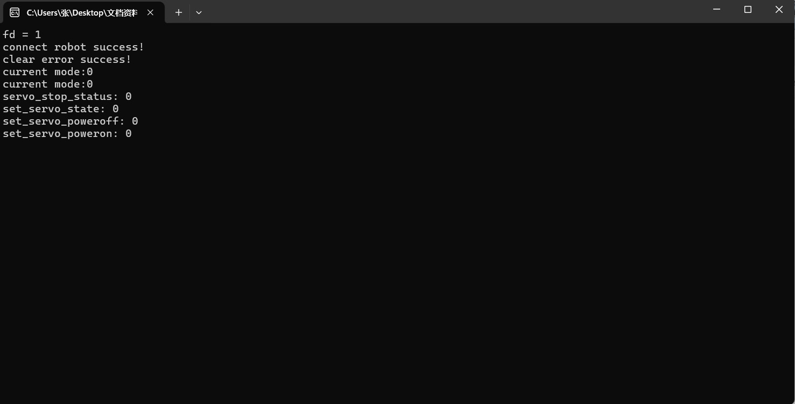
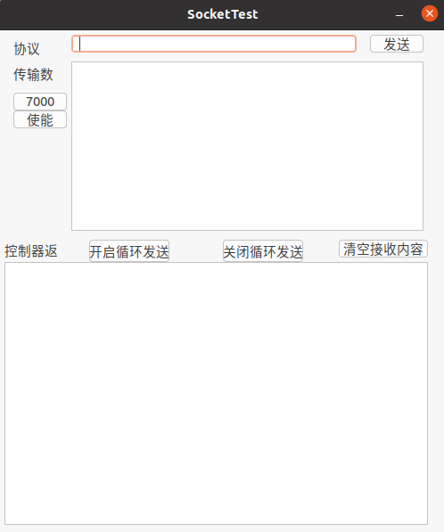
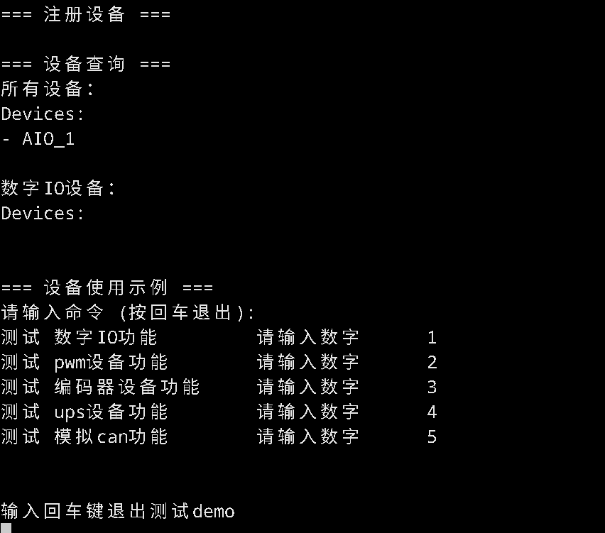

# Demo示例

## 下载

控制器二次开发demo下载

## 下载

示教器二次开发demo下载

- 控制器二次开发
- 示教器二次开发
- 上位机二次开发

## 下载

python上位机二次开发demo下载

- Python

## 下载

C#上位机二次开发demo下载

- C#

## 下载

C++上位机二次开发demo下载

- C++

## 下载

JSON协议二次开发demo下载

- JSON协议二次开发

## 下载

HAL二次开发demo下载

- HAL二次开发
