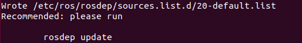
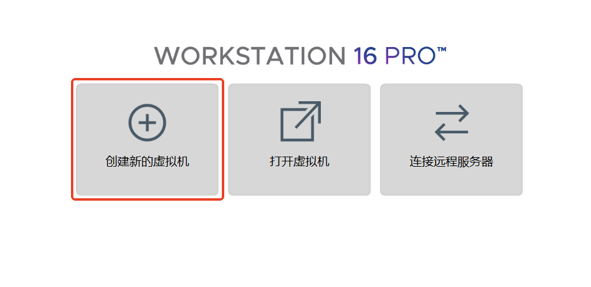

# ROS 1 安装

本文介绍在 Ubuntu 18.04 上安装 ROS 1 Melodic 的完整步骤，以及常见错误的处理方法。

## 1. 配置软件源

Ubuntu 默认软件源速度较慢，建议更换为国内镜像（以阿里云为例）。

### 备份原 sources.list

```bash
sudo cp /etc/apt/sources.list /etc/apt/sources.list_backup
```

### 替换为阿里云镜像源

```bash
sudo gedit /etc/apt/sources.list
```

在文件最前面添加：

```bash
deb http://mirrors.aliyun.com/ubuntu/ bionic main restricted universe multiverse
deb http://mirrors.aliyun.com/ubuntu/ bionic-security main restricted universe multiverse
deb http://mirrors.aliyun.com/ubuntu/ bionic-updates main restricted universe multiverse
deb http://mirrors.aliyun.com/ubuntu/ bionic-proposed main restricted universe multiverse
deb http://mirrors.aliyun.com/ubuntu/ bionic-backports main restricted universe multiverse
deb-src http://mirrors.aliyun.com/ubuntu/ bionic main restricted universe multiverse
deb-src http://mirrors.aliyun.com/ubuntu/ bionic-security main restricted universe multiverse
deb-src http://mirrors.aliyun.com/ubuntu/ bionic-updates main restricted universe multiverse
deb-src http://mirrors.aliyun.com/ubuntu/ bionic-proposed main restricted universe multiverse
deb-src http://mirrors.aliyun.com/ubuntu/ bionic-backports main restricted universe multiverse
```

### 刷新软件列表

```bash
sudo apt-get update
sudo apt-get upgrade
sudo apt-get install build-essential
```

## 2. 添加 ROS 软件源

### 官方源

```bash
sudo sh -c 'echo "deb http://packages.ros.org/ros/ubuntu $(lsb_release -sc) main" > /etc/apt/sources.list.d/ros-latest.list'
```

### 清华源（推荐国内使用）

```bash
sudo sh -c '. /etc/lsb-release && echo "deb http://mirrors.tuna.tsinghua.edu.cn/ros/ubuntu/ `lsb_release -cs` main" > /etc/apt/sources.list.d/ros-latest.list'
```

## 3. 添加密钥

```bash
sudo apt-key adv --keyserver 'hkp://keyserver.ubuntu.com:80' --recv-key C1CF6E31E6BADE8868B172B4F42ED6FBAB17C654
```

## 4. 安装 ROS

```bash
sudo apt update
sudo apt install ros-melodic-desktop-full
```

## 5. 安装并初始化 rosdep

```bash
sudo apt update
sudo apt install python-rosdep
sudo rosdep init
rosdep update
```

如果一切顺利，rosdep 初始化与更新的打印结果如下：




### rosdep 初始化失败的解决

若初始化失败（因 GitHub 服务器访问受限），可先尝试用手机热点连接网络进行 `rosdep init`，仍不行则按以下步骤修改。

#### 修复 sources_list.py

```bash
sudo gedit /usr/lib/python2.7/dist-packages/rosdep2/sources_list.py
```

在 `download_rosdep_data` 函数中，将 `url = "https://raw.githubusercontent.com/..."` 改为 `url = "https://ghproxy.com/" + url`。

#### 修复 rosdistro/__init__.py

```bash
sudo gedit /usr/lib/python2.7/dist-packages/rosdistro/__init__.py
```

找到 `DEFAULT_INDEX_URL`（第 72 行），改为：

```python
DEFAULT_INDEX_URL = 'https://ghproxy.com/https://raw.githubusercontent.com/ros/rosdistro/master/index-v4.yaml'
```

#### 修复 gbpdistro_support.py

```bash
sudo gedit /usr/lib/python2.7/dist-packages/rosdep2/gbpdistro_support.py
```

在 `download_rosdep_data` 函数开头（第 36 行附近）添加：

```python
gbpdistro_url = "https://ghproxy.com/" + gbpdistro_url
```

#### 修复 rep3.py

```bash
sudo gedit /usr/lib/python2.7/dist-packages/rosdep2/rep3.py
```

在约第 39 行处添加代理前缀。

#### 修复 manifest_provider/github.py

```bash
sudo gedit /usr/lib/python2.7/dist-packages/rosdistro/manifest_provider/github.py
```

在约第 68 行和第 119 行处添加代理前缀。

#### 处理 DNS 问题

如果依然不能解决报错，尝试修改 DNS：

```bash
sudo gedit /etc/resolv.conf
```

将原有的 `nameserver` 行注释，并添加：

```bash
nameserver 8.8.8.8
nameserver 8.8.4.4
```

保存退出，执行：

```bash
sudo apt-get update
```

再执行：

```bash
sudo rosdep init
```

如果报错提示 `default sources list file already exists`，先删除已存在的文件：

```bash
sudo rm /etc/ros/rosdep/sources.list.d/20-default.list
```

然后重新运行 `sudo rosdep init`。

## 6. 设置环境变量

```bash
echo "source /opt/ros/melodic/setup.bash" >> ~/.bashrc
source ~/.bashrc
```

## 7. 安装 ROS 功能包

```bash
sudo apt-get install ros-melodic-moveit
sudo apt-get install ros-melodic-joint-state-publisher
sudo apt-get install ros-melodic-robot-state-publisher
sudo apt install ros-melodic-gazebo-ros-pkgs
sudo apt-get install ros-melodic-gazebo-ros-control
sudo apt-get install ros-melodic-joint-trajectory-controller
sudo apt-get install ros-melodic-industrial-core
```

## 8. 测试

ROS 内置了一些小程序，可以通过运行这些小程序以检测 ROS 环境是否可以正常运行。

### 启动 roscore

```bash
roscore
```

### 启动小海龟仿真器

另起一个终端：

```bash
rosrun turtlesim turtlesim_node
```

### 启动键盘控制

再打开一个终端：

```bash
rosrun turtlesim turtle_teleop_key
```

将光标悬停在这个终端中，然后使用 ↑、↓、←、→ 键来控制小海龟移动：


