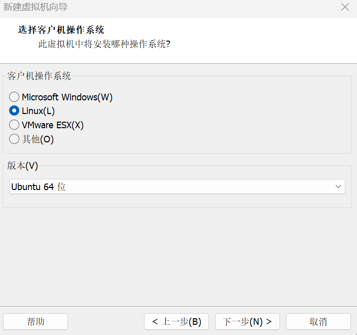
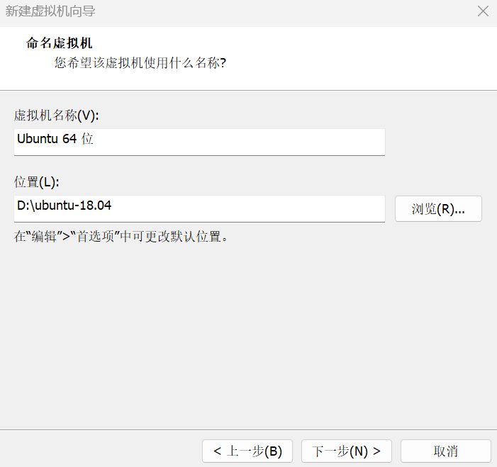

# ROS 与 Qt 联合使用

将 Qt 工程与 ROS 1 结合，使可以通过 `rosrun` 或 `roslaunch` 指令运行。核心思路是将 Qt 项目改造为 ROS 功能包，并正确配置 CMakeLists.txt。以下为完整步骤。

## 1. 检查 g++ 版本

Qt5 需要 g++ 4.8 及以上版本：

```bash
g++ --version
gcc --version
```

## 2. 创建 ROS 工作空间

```bash
source /opt/ros/noetic/setup.bash
mkdir -p ~/inexbot/src
cd ~/inexbot/src
catkin_create_pkg Qt_test roscpp std_msgs
```

## 3. 调整 Qt 工程结构

首先创建一个 Qt 工程，构成文件如下，其中 `libs` 是库文件 `.so` 及其包含的头文件 `.h`：


Qt 工程需要略微调整结构才能作为 ROS 功能包使用，如下所示：



其中，将原工程中的 `main.cpp`、`mainwindow.cpp`、`Qt_test.pro` 文件放到 `src` 中，`mainwindow.h` 放到 `include/Qt_test` 中：



## 4. 修改 CMakeLists.txt

这是最关键的一步。需要修改功能包下的 `CMakeLists.txt` 文件，使其能够编译 Qt 项目。ROS 使用 CMake，而 Qt 通常使用 qmake，但可以通过 CMake 的 `find_package` 来定位 Qt。

```cmake
cmake_minimum_required(VERSION 3.0.2)
project(Qt_test)

# 寻找 Catkin 和 ROS 包
find_package(catkin REQUIRED COMPONENTS
  roscpp
  std_msgs
)

# 设置 C++ 标准
set(CMAKE_CXX_STANDARD 11)
set(CMAKE_CXX_STANDARD_REQUIRED ON)

# 寻找 Qt5
set(Qt5_DIR "/usr/lib/x86_64-linux-gnu/cmake/Qt5")
find_package(Qt5 COMPONENTS Core Widgets REQUIRED)

# Catkin 包配置
catkin_package(
  CATKIN_DEPENDS roscpp std_msgs
)

# 包含目录
include_directories(
  include
  /opt/ros/noetic/include
  ${catkin_INCLUDE_DIRS}
  ${Qt5Widgets_INCLUDE_DIRS}
)

# 设置自动处理
set(CMAKE_AUTOMOC ON)
set(CMAKE_AUTORCC ON)
set(CMAKE_AUTOUIC ON)  # 确保这行存在

# 处理资源文件（如果有 .qrc 文件）
file(GLOB RESOURCE_FILES "*.qrc")
qt5_add_resources(QT_RESOURCES ${RESOURCE_FILES})

# 源文件
set(SRC_FILES
  src/main.cpp
  src/mainwindow.cpp
)

# 头文件
set(HEADER_FILES
  include/Qt_test/mainwindow.h
  libs/include/cpp_interface/nrc_api.h
  libs/include/cpp_interface/nrc_interface.h
)

# 添加库路径
link_directories(${PROJECT_SOURCE_DIR}/libs)

# 创建可执行文件
add_executable(${PROJECT_NAME}
  ${SRC_FILES}
  ${HEADER_FILES}
  ${QT_UI_HEADERS}
  ${QT_RESOURCES}
)

# 链接库
target_link_libraries(${PROJECT_NAME}
  ${catkin_LIBRARIES}
  Qt5::Widgets
  Qt5::Core
  nrc_host
)

# 安装可执行文件
install(TARGETS ${PROJECT_NAME}
  RUNTIME DESTINATION ${CATKIN_PACKAGE_BIN_DESTINATION}
)

# 安装库文件（可选）
install(FILES libs/libnrc_host.so
  DESTINATION ${CATKIN_PACKAGE_LIB_DESTINATION}
)
```

**说明：**

- `qt5_add_resources`：将 `.qrc` 资源文件嵌入可执行文件；
- `CMAKE_AUTOMOC`、`CMAKE_AUTORCC`、`CMAKE_AUTOUIC`：自动处理 Qt 元对象编译器、资源编译器、UI 转换；
- 确保源文件路径（如 `src/main.cpp`）正确。

## 5. 编译功能包

回到工作空间根目录进行编译：

```bash
cd ~/inexbot
catkin_make
```

如果编译成功，应该能在 `~/inexbot/devel/lib/Qt_test/` 目录下找到生成的可执行文件 `Qt_test`：


## 6. 运行

```bash
# 首先确保 roscore 已运行
roscore

# 然后运行该节点
source ~/inexbot/devel/setup.bash
rosrun Qt_test Qt_test
```


## 常见问题与提示

- **环境变量**：确保终端已经 `source /opt/ros/noetic/setup.bash` 和 `source ~/inexbot/devel/setup.bash`；
- **Qt 版本**：ROS Noetic 默认基于 Ubuntu 20.04，其 Qt5 版本是 5.12，需要确保项目与该版本兼容；
- **依赖**：如果项目依赖其他 ROS 包（如 rviz、tf 等），需要在 `catkin_create_pkg` 和 `find_package(catkin ...)` 中添加它们。
