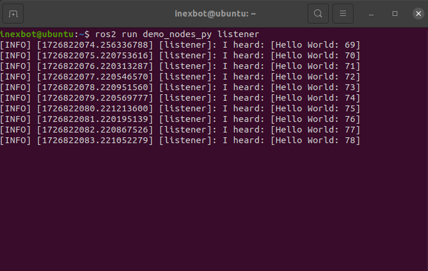

# ROS 2 安装

本文介绍在 Ubuntu 20.04 及以上版本中安装 ROS 2 的完整步骤，以 Ubuntu 22.04 + ROS 2 Humble 为例。

## 准备工作

### 检查 Ubuntu 版本

```bash
lsb_release -a
```

Ubuntu 22.04 对应 ROS 2 Humble 版本。Foxy 之后的版本才开始支持 Ubuntu 22.04，更详细的版本对应关系可参考 ROS 官方文档。


## 方法一：手动安装

### 1. 基础环境配置

#### 设置 locale

确保系统支持 UTF-8 编码：

```bash
sudo apt update && sudo apt install locales
sudo locale-gen en_US en_US.UTF-8
sudo update-locale LC_ALL=en_US.UTF-8 LANG=en_US.UTF-8
export LANG=en_US.UTF-8
```

#### 配置软件源

```bash
sudo apt install software-properties-common
sudo add-apt-repository universe
```

#### 添加 ROS 2 GPG key

```bash
sudo apt update && sudo apt install curl gnupg2 -y
sudo curl -sSL https://gitee.com/tyx6/rosdistro/raw/master/ros.key -o /usr/share/keyrings/ros-archive-keyring.gpg
```

#### 添加软件仓库

**官方源：**

```bash
echo "deb [arch=$(dpkg --print-architecture) signed-by=/usr/share/keyrings/ros-archive-keyring.gpg] http://packages.ros.org/ros2/ubuntu $(. /etc/os-release && echo $UBUNTU_CODENAME) main" | sudo tee /etc/apt/sources.list.d/ros2.list > /dev/null
```

**清华源（推荐国内使用）：**

```bash
echo "deb [arch=$(dpkg --print-architecture) signed-by=/usr/share/keyrings/ros-archive-keyring.gpg] https://mirrors.tuna.tsinghua.edu.cn/ros2/ubuntu $(. /etc/os-release && echo $UBUNTU_CODENAME) main" | sudo tee /etc/apt/sources.list.d/ros2.list > /dev/null
```

### 2. 安装 ROS 2

#### 更新系统

```bash
sudo apt update
sudo apt upgrade
```

#### 安装 ROS 2

```bash
sudo apt install ros-humble-desktop
```

#### 配置环境变量

```bash
echo "source /opt/ros/humble/setup.bash" >> ~/.bashrc
source ~/.bashrc
```

### 3. 验证安装

#### 测试通信功能

终端 1，启动发布者：

```bash
ros2 run demo_nodes_cpp talker
```

若正常，将显示以下信息：


终端 2，启动订阅者：

```bash
ros2 run demo_nodes_py listener
```

正常将显示以下信息：



若两个终端中均显示 `Hello World` 字符串，说明通信正常。

#### 测试小海龟仿真器

终端 1，启动海龟仿真器：

```bash
ros2 run turtlesim turtlesim_node
```

终端 2，启动键盘控制：

```bash
ros2 run turtlesim turtle_teleop_key
```

效果如下图所示：


### 4. 配置 rosdep

rosdep 是 ROS 的依赖管理工具，部分功能包源码编译时需要用它安装系统依赖。

rosdep 访问的是 GitHub 国外服务器，建议将地址替换为国内镜像。

#### 安装 rosdep

```bash
sudo apt install python3-rosdep
```

#### 自动修改配置（推荐）

下载并运行一键修复脚本：

```bash
wget https://gitee.com/tyx6/mytools/raw/main/ros/Mrosdep.py
sudo python3 Mrosdep.py
```

注：此脚本在 rosdistro 目录下，若脚本执行失败可手动修改，方法如下。

#### 手动修改配置

需手动修改以下 4 个文件，将 `https://raw.githubusercontent.com/...` 替换为 `https://gitee.com/...`：

```bash
sudo gedit /usr/lib/python3/dist-packages/rosdep2/sources_list.py    # 约64行
sudo gedit /usr/lib/python3/dist-packages/rosdistro/__init__.py       # 约68行
sudo gedit /usr/lib/python3/dist-packages/rosdep2/gbpdistro_support.py # 约34行
sudo gedit /usr/lib/python3/dist-packages/rosdep2/rep3.py               # 约36行
```

#### 完成初始化

```bash
sudo rosdep init
rosdep update
```

注意：若总是配置失败，可尝试方法二一键配置。

## 方法二：一键安装

使用小鱼的一键安装脚本，可自动完成 ROS 2 安装、rosdep 配置和环境变量设置：

```bash
wget http://fishros.com/install -O fishros && . fishros
```


