# Ubuntu 22.04 安装

本文介绍通过 VMware 安装 Ubuntu 22.04 虚拟机的完整步骤。使用清华大学开源镜像站下载镜像，安装时可省去手动换源的步骤。

## 下载镜像

从清华大学开源镜像站下载 Ubuntu 22.04 LTS 镜像：

https://mirrors.tuna.tsinghua.edu.cn/ubuntu-releases/22.04/

## 创建虚拟机

### VMware 配置步骤

1. 打开 VMware，点击 **创建新的虚拟机**，开始配置虚拟机环境。

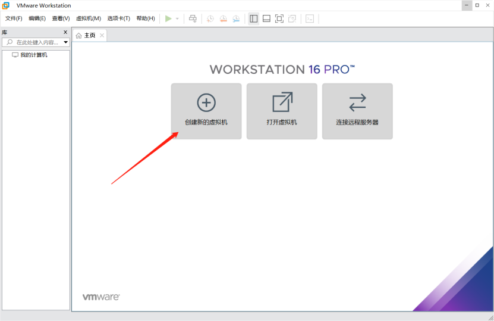

2. 选择 **自定义（高级）**，点击 **下一步**。

3. 根据 VMware 版本选择硬件兼容性，点击 **下一步**。

4. 选择 **稍后安装操作系统**，点击 **下一步**。

5. 选择 **Linux**，版本选择 **Ubuntu 64位**，点击 **下一步**。

6. 设置虚拟机名称和安装位置（建议不要放在 C 盘），点击 **下一步**。

7. 设置处理器数量和内核数量，点击 **下一步**。

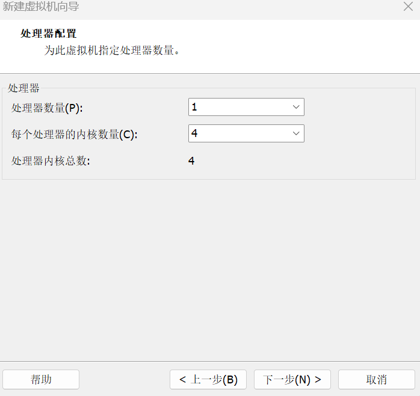

8. 配置内存（建议 4GB 以上），点击 **下一步**。

9. 选择 **使用网络地址转换（NAT）**，点击 **下一步**。

10. 按默认推荐配置，点击 **下一步**。

11. 选择 **SCSI（S）**，点击 **下一步**。

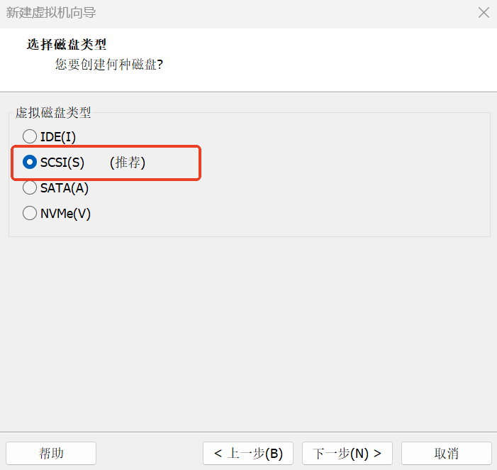

12. 选择 **创建新虚拟磁盘**，点击 **下一步**。

13. 分配磁盘容量（推荐 80GB，可根据需要调整），选择 **将虚拟磁盘拆分为多个文件**，点击 **下一步**。

14. 点击 **下一步**。

15. 点击 **自定义硬件**，移除打印机（节省资源）。

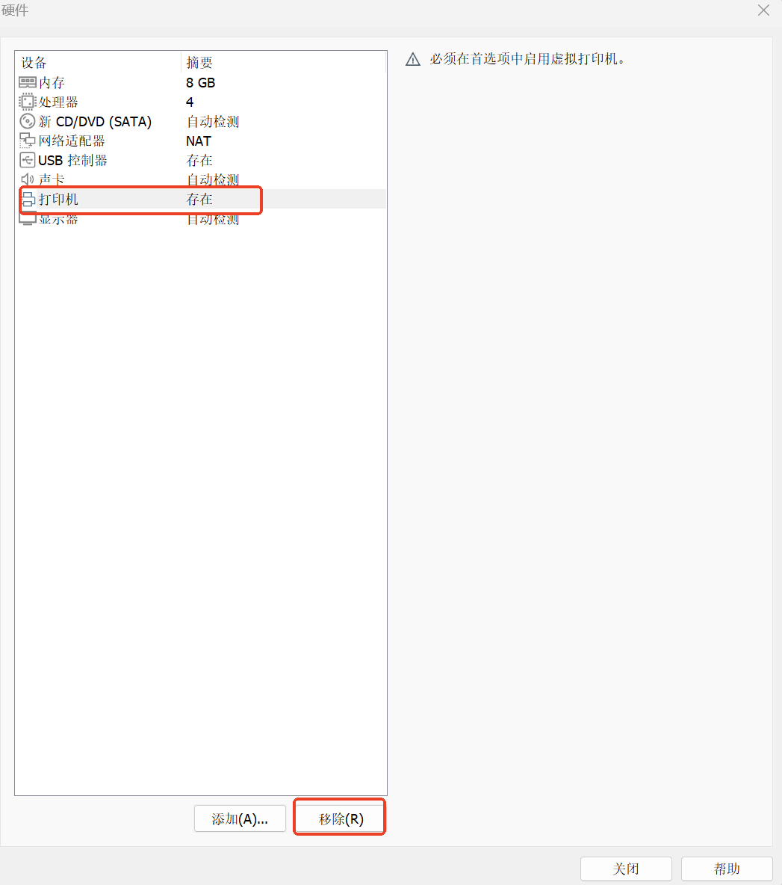

16. 选择 **新 CD/DVD (SATA)**，点击 **使用 ISO 映像文件**，浏览并选择下载好的 Ubuntu 镜像文件，然后点击 **关闭**。

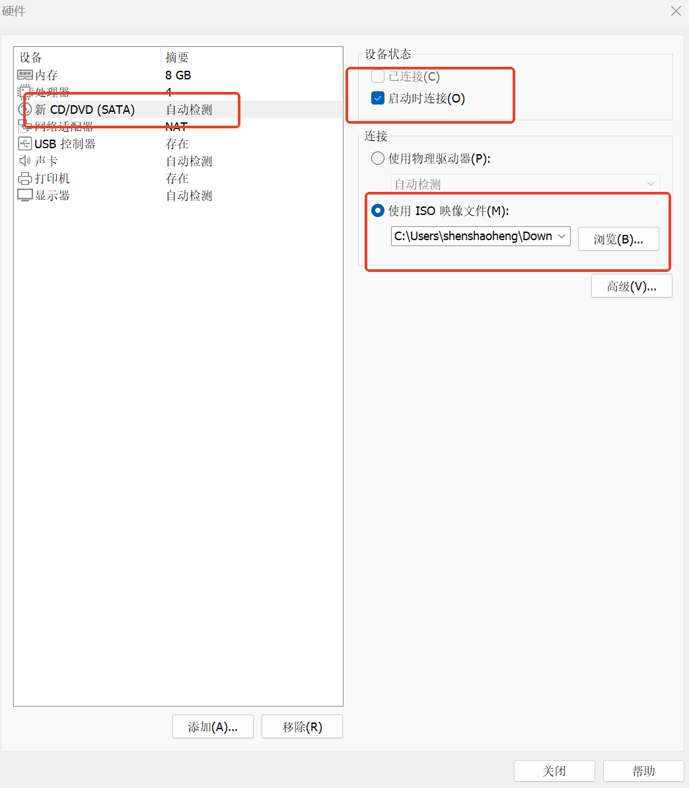

17. 点击 **完成**，然后点击 **开启此虚拟机**。

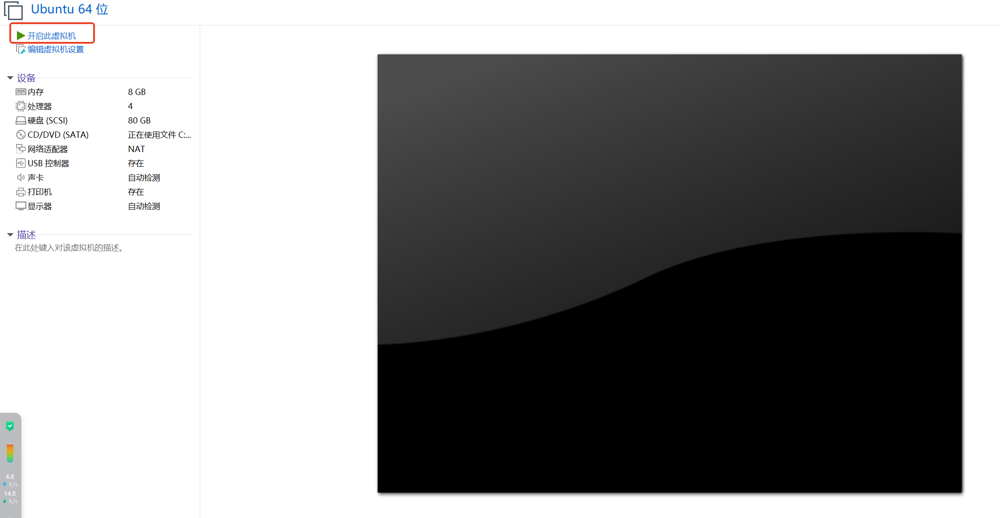

## 安装 Ubuntu 22.04

### 启动虚拟机

1. 选择 **Try or install ubuntu**，按回车。

2. 左边下拉选择 **中文（简体）**，点击 **安装 Ubuntu**。

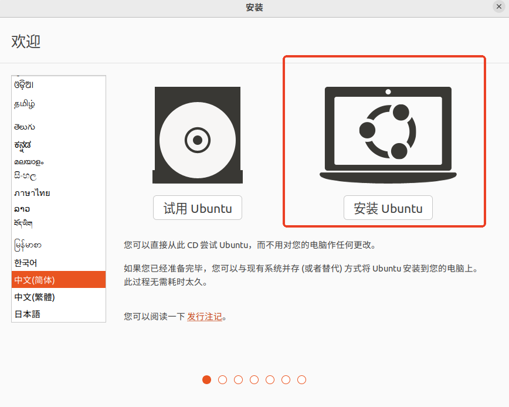

### 配置安装选项

1. 点击 **继续**。

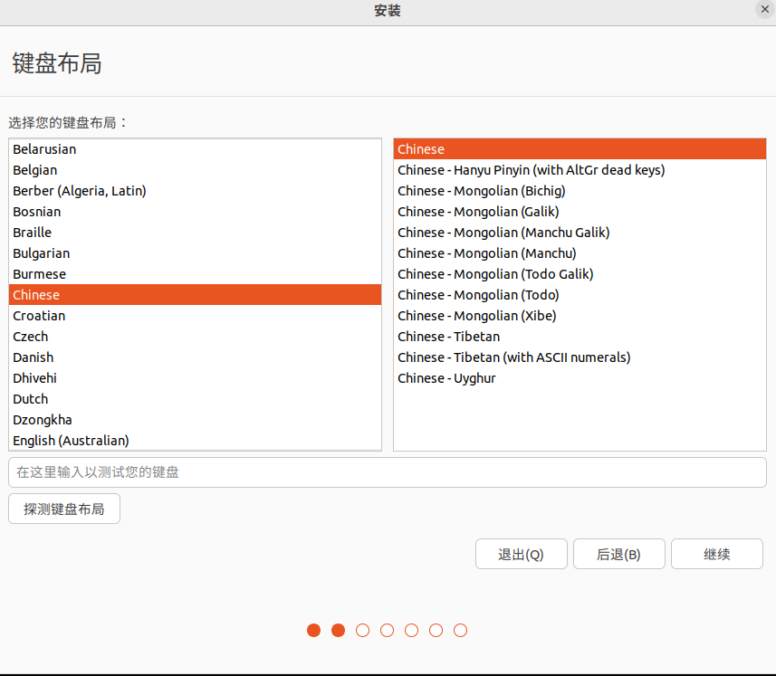

2. 选择 **正常安装** 或 **最小安装**，点击 **继续**。

3. 选择 **清除整个磁盘并安装 Ubuntu**，点击 **现在安装**。

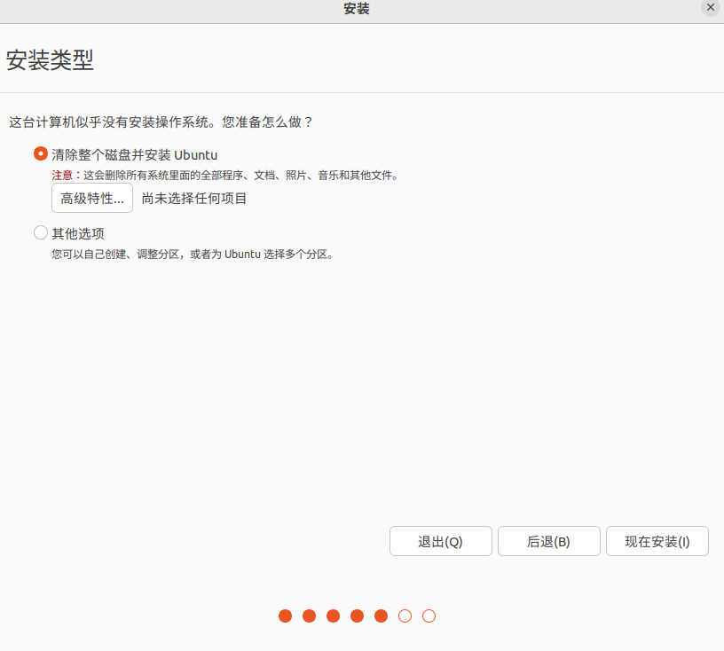

4. 点击 **继续**。

5. 点击 **继续**。

6. 设置用户名和密码，点击 **继续**，等待安装完成。

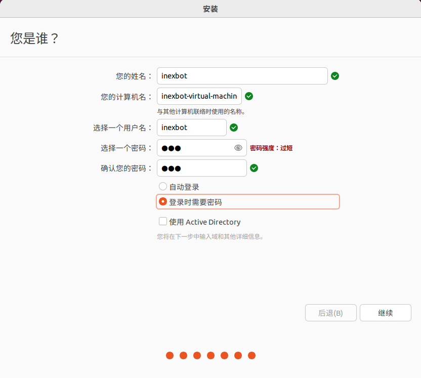

### 初始配置

1. 重启后点击 **跳过**。

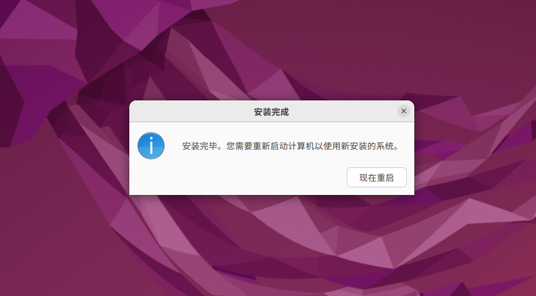

2. 后续几步根据提示点击前进，最后点击 **完成**。若弹出提示框，点击 **稍后提醒** 即可。

