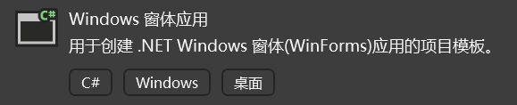
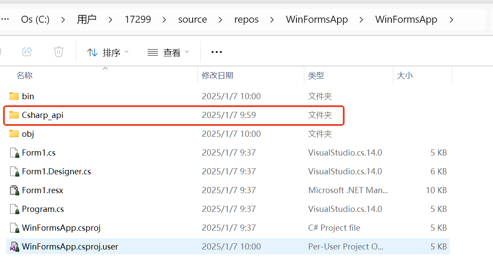

# 初始化项目

# C#

首先，在资源下载找到 C# 版本 SDK 的下载栏，选择 SDK_CSharp_x64 下载。

## 1 创建项目，导入SDK

选择 C#  “Windows窗体应用”创建。

创建好项目后，将 SDK 拷贝到新创建的项目文件夹中。

再将动态库放到生成路径下

在 Visual Studio 2022 顶栏中点击>项目>显示所有文件，来将我们刚刚拷贝的文件显示出来。

完成上述步骤后，在左侧“解决方案资源管理器”中，会显示出我们刚刚拷贝进来的 “Csharp_api” 文件夹。

右键点击 "Csharp_api" 选择>包括在项目中选项将其包含。

完成后，再一次点击 Visual Studio 2022 顶栏上>项目>显示所有文件，来取消显示所有文件。

点击本地 Windows 调试器，如果使用的 Release 版本的库，需要将 Debug 切换为 Release。

如果没有报错，表示我们成功的引入了 SDK。

更多示例可以浏览接口示例 | 纳博特科技

- 使用的 IDE 为： Visual Studio 2022
- 编译生成工具为：.NET 8.0
