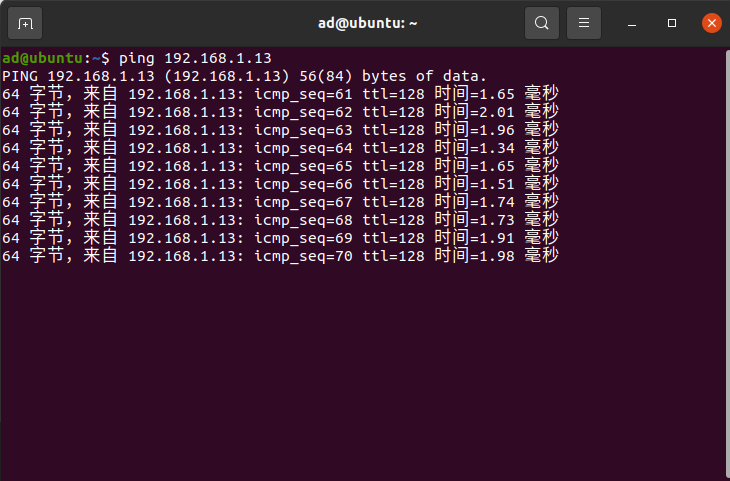
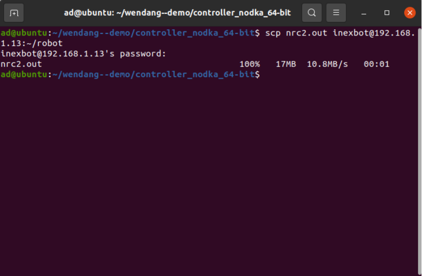
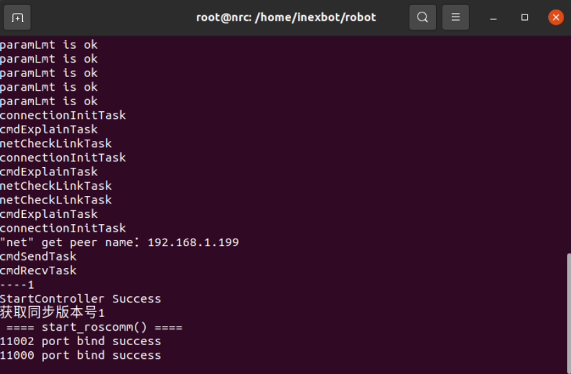

# 快速开始

# 1. 环境安装

## 1.1 系统要求

当前推荐的开发环境操作系统为：

当前支持的编译套件包括：

- Ubuntu 20.04

需要根据不同的控制器型号，选择不同的编译套件。

我们提供打包了所有开发环境的镜像文件，当然也可以在任意一台 Ubuntu 20.04 下参照小节《1.2 编译套件安装》来安装。

> 直接获取安装好了的虚拟机
> 点击这里 可以下载得到配置好开发环境的、基于VirtualBox软件使用的Ubuntu 20.04.1 系统的虚拟机;
> 点击这里 可以下载得到基于Windows系统的VirtualBox软件安装包，如需其他系统版本的请自行到 VirtualBox官网 进行下载。
> •
> 安装VirtualBox软件（注意按转路径不能带有中文）
> •
> 打开下载的“开发环境虚拟机”文件夹，按照“README.txt”文件说明安装虚拟机;
> •
> 开机后登录账户“nbt”，密码是“123”。

## 1.2 编译套件安装

以下编译链根据具体的控制器硬件选择安装：

### 1.2.1 gcc-4.8 编译套件安装

因为 Ubuntu 20.04 自带的源 gcc 最低版本无法安装4.8。我们需要添加 trusty 的源。

```bash
sudo sh -c 'echo "deb http://dk.archive.ubuntu.com/ubuntu/ trusty main" >> /etc/a pt/sources.list'
sudo sh -c 'echo "deb http://dk.archive.ubuntu.com/ubuntu/ trusty universe" >> /e tc/apt/sources.list'
```

```bash
sudo apt update
sudo apt install -y gcc-4.8 g++-4.8
sudo update-alternatives --install /usr/bin/gcc gcc /usr/bin/gcc-4.8 40
sudo update-alternatives --install /usr/bin/g++ g++ /usr/bin/g++-4.8 40
sudo apt-get install -y gcc-4.8-multilib g++-4.8-multilib
```

下载 lib32 库文件

解压lib32.xxx文件，并替换原有的/usr/lib32文件夹。

```bash
tar -zxvf lib32.xxx
sudo rm -rf /usr/lib32
sudo mv usr/lib32 /usr/
```

### 1.2.2 gcc-9.4 编译套件安装

Ubuntu20.04 的源直接安装即可。

```bash
sudo apt install gcc g++
```

### 1.2.3 aarch64-linux-gnu-gcc-5.3 编译套件安装

下载编译套件：链接: gcc-linaro-5.3.1-2016.05-x86_64_aarch64-linux-gnu.tar.gz 提取码: w33y

新建T5⽂件夹，将gcc-linaro-5.3.1-2016.05-x86_64_aarch64-linux-gnu.tar.gz解压进去。

```bash
mkdir ~/T5
tar -zxvf gcc-linaro-5.3.1-2016.05-x86_64_aarch64-linux-gnu.tar.gz -C ~/T5
```

添加环境变量

```bash
gedit ~/.bashrc
```

将下面这行拷贝到最后，保存退出即可。

```bash
export PATH=$PATH:$HOME/T5/gcc-linaro-5.3.1-2016.05-x86_64_aarch64-linux-gnu/bin
```

# 2. 构建项目

## 2.1 项目初始化

可以使用VS code或者其它IDE来开发。

新建一个 demo 文件夹，将头文件放到include文件夹下，将 libNexRob.a 放到lib文件夹下。，目录的结构参考如下：

```text
├── include
│   ├── nrcAPI.h
│   └── nrcAPI_advance.h
├── lib
│   └── libNexRob.a
└── src
    └── main.cpp
```

## 2.2 main.cpp文件

```cpp
#include <iostream>
#include "nrcAPI.h"


void SystemStartup() {
  //输出Nexmotion版本库信息
  std::cout << "库版本：" << NRC_GetNexMotionLibVersion() << std::endl;
  //启动控制系统
  NRC_StartController();
  //检测控制系统是否初始化完成
  while (NRC_GetControlInitComplete() != 1 ) {
    NRC_Delayms(100);   //延时100ms
  }
  //清除所有错误
  NRC_ClearAllError();


  std::cout << "----" << NRC_GetControlInitComplete() << std::endl;
  std::cout << "StartController Success" << std::endl;
  std::cout << "获取同步版本号" << NRC_GetSyncVersion() << std::endl;
  NRC_Delayms(200);
}


int main() {
  //系统启动
  SystemStartup();

  std::cout << "Hello World" << std::endl;


  //保持程序继续运行
  while(true) {
    NRC_Delayms(2000);
  }
}
```

## 2.3 编译代码

### 2.3.1 直接编译

确认自己的控制器系统架构，选择对应的编译链工具，下面使用的是gcc-4.8，根据架构不同，可以换成gcc-9。

> 注：如果是x64架构的控制器需要将g++-4.8修改为g++-9，-m32修改为-m64，如果控制器是x86架构的可不用进行修改。

```bash
g++-4.8 -m32 -o nrc2.out src/*.cpp -I./include -L./lib -lNexRob -lpthread -lm -ldl -lrt -std=c++11
```

### 2.3.2 使用Makefile

新建Makeifile文件

在demo目录下新建Makefile文件，将下面内容拷贝到Makefile文件中，并保存。

```makefile
TARGET=nrc2.out
all :
	g++-4.8 -m32 -o nrc2.out src/*.cpp -I./include -L./lib -lNexRob -lpthread -lm -ldl -lrt -std=c++11


clean :
	rm $(TARGET) $(objects)
```

Makefile文件建好之后在编译时只需要在demo文件目录下打开终端输入make即可编译控制器可执行程序

在demo目录下打开一个新的终端，输入make，编译完成后在demo目录下有一个nrc2.out的可执行程序

编译的流程如下图：


# 3. 远程登陆到控制器

## 3.1 确认电脑连接上控制器

首先确保你的电脑已经跟控制器连接了通讯，电脑的IP需要跟控制器的IP在同一网段下。控制器的出厂默认IP为192.168.1.13，所以电脑连接控制器的网口同样需要设置为1网段（比如可以设置192.168.1.110）。设置完成之后在Ubuntu中打开一个新的终端输入

```bash
ping 192.168.1.13
```

出现下面如图所示，即为同控制器通讯通讯成功：



如出现不成功的情况，请检查网线的连接，电脑的IP，控制器的IP。

# 3.2 使用ssh登陆到控制器

```bash
ssh inexbot@192.168.1.13
```

然后密码输入123，即可进行远程控制了。

# 3.3 查看控制器系统架构

登陆进控制器后，可以通过uname -a查看控制器的架构


图中所示是三个i686，分别为机器硬件名，处理器类型，硬件平台。i686我们俗称为32位系统。

# 4. 将程序上传到控制器运行

## 4.1 使用SCP上传程序

编译完成后，我们将要把程序给替换进控制器当中运行我们自己编译的二次开发程序，继续在当前终端下输入

```bash
scp nrc2.out inexbot@192.168.1.13:~/robot
```

输入完成后会出现一句 “ inexbot@192.168.1.13's password: “。

我们继续敲123即可，当出现下图就表示程序已经程序替换进控制器当中了。



当然也会出现替换不成功的时候，终端会显示Text file busy，这种情况就是控制器原本的nrc2.out程序还在运行，无法被替换。

这就需要ssh远程登陆到控制器的后台中将正在开启的nrc2.out进程给关闭。

```bash
sudo killall -9 nrc2.out
```

进程关闭后就可以再次执行上面提到的scp的操作，就可以成功把二次开发程序替换到控制器当中。

## 4.2 远程登陆到控制器中启动程序

随后就可以执行我们编译的二次开发程序，，在控制器后台的robot目录下输入

```bash
sudo ./nrc2.out
```

执行的效果如下如：



到这一步我们的二次开发项目已经成功运行起来了。

- gcc-4.8
- gcc-9.4
- aarch64-linux-gnu-gcc-5.3
