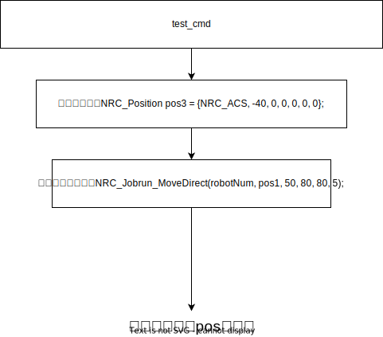

# 自定义指令

## 控制器二次开发demo在相关下载当中的控制器SDK下，自行下载

## 1，介绍自定义指令所用到接口函数

下列函数都包括在SDK中的头文件中:

```cpp
/**
 * @brief 供自定义作业文件指令调用的MOVJ指令，不可直接调用
 * @param robotNum 机器人编号[1-4]
 * @param pos　机器人运动目标位置，详见 NRC_Position
 * @param vel 机器人的运行速度，为机器人最大速度的百分比，参数范围：0 < vel <= 100
 * @param acc 机器人运行加速度，为机器人各关节最大加速度的百分比，参数范围：0 < vel <= 100
 * @param dec 机器人运行减速度，为机器人各关节最大减速度的百分比，参数范围：0 < vel <= 100
 * @param pl 平滑度，将和后面一条移动指令进行平滑过渡，数值越大，越平滑，轨迹偏差也越大，参数范围：0 <= pl <= 5
 * @param moveToNextLine 是否跳行，只需要在最后的一条指令将moveToNextLine置为true
 */
void NRC_Jobrun_MoveDirect(int robotNum, const NRC_Position & pos, double vel,  double acc, double dec, int pl, bool moveToNextLine = false);


/**
 * @brief 供自定义作业文件指令调用的MOVL指令，不可直接调用
 * @param robotNum 机器人编号[1-4]
 * @param pos　机器人运动目标位置，详见 NRC_Position
 * @param vel 机器人的运行速度，为机器人末端位置点绝对运行速度，单位为 毫米每秒（mm/s），参数范围：vel > 1
 * @param acc 机器人运行加速度，为机器人各关节最大加速度的百分比，参数范围：0 < vel <= 100
 * @param dec 机器人运行减速度，为机器人各关节最大减速度的百分比，参数范围：0 < vel <= 100
 * @param pl 平滑度，将和后面一条移动指令进行平滑过渡，数值越大，越平滑，轨迹偏差也越大，参数范围：0 <= pl <= 5
 * @param moveToNextLine 是否跳行，只需要在最后的一条指令将moveToNextLine置为true
 */
void NRC_Jobrun_MoveLinear(int robotNum, const NRC_Position & pos, double vel, double acc, double dec, int pl, bool moveToNextLine = false);


/**
 * @brief 供自定义作业文件指令调用的MOVC指令，不可直接调用
 * @param robotNum 机器人编号[1-4]
 * @param mid_pos,end_pos　机器人运动目标位置，详见 NRC_Position
 * @param vel 机器人的运行速度，为机器人末端位置点绝对运行速度，单位为 毫米每秒（mm/s），参数范围：vel > 1
 * @param acc 机器人运行加速度，为机器人各关节最大加速度的百分比，参数范围：0 < vel <= 100
 * @param dec 机器人运行减速度，为机器人各关节最大减速度的百分比，参数范围：0 < vel <= 100
 * @param pl 平滑度，将和后面一条移动指令进行平滑过渡，数值越大，越平滑，轨迹偏差也越大，参数范围：0 <= pl <= 5
 * @param moveToNextLine 是否跳行，只需要在最后的一条指令将moveToNextLine置为true
 * @note 注意，MOVC不可作为第一条指令运行，且第一次调用时前面必须要有MOVJ或者MOVL指令
 */
void NRC_Jobrun_MoveC(int robotNum, const NRC_Position& mid_pos,const NRC_Position& end_pos, double vel, double acc, double dec, int pl, bool moveToNextLine = false);


/**
 * @brief 供自定义作业文件指令调用的MOVS指令，不可直接调用
 * @param robotNum 机器人编号[1-4]
 * @param pos 机器人运动目标位置容器，大小不可小于4(即pos.size() >= 4)，点位设置详见 NRC_Position
 * @param vel 机器人的运行速度，为机器人末端位置点绝对运行速度，单位为 毫米每秒（mm/s），参数范围：vel > 1
 * @param acc 机器人运行加速度，为机器人各关节最大加速度的百分比，参数范围：0 < vel <= 100
 * @param dec 机器人运行减速度，为机器人各关节最大减速度的百分比，参数范围：0 < vel <= 100
 * @param pl 平滑度，将和后面一条移动指令进行平滑过渡，数值越大，越平滑，轨迹偏差也越大，参数范围：0 <= pl <= 5
 * @param moveToNextLine 是否跳行，只需要在最后的一条指令将moveToNextLine置为true
 * @note 注意，MOVS不可作为第一条指令运行，且第一次调用时前面必须要有MOVJ或者MOVL指令
 */
void NRC_Jobrun_MoveS(int robotNum, int pointNum, const std::vector< NRC_Position>& pos, double vel, double acc, double dec, int pl, bool moveToNextLine = false);


/**
 * @brief 供自定义作业文件指令调用的IMOV指令，不可直接调用
 * @param robotNum 机器人编号[1-4]
 * @param pos 机器人运动目标位置容器，大小不可小于4(即pos.size() >= 4)，点位设置详见 NRC_Position
 * @param vel 机器人的运行速度，为机器人末端位置点绝对运行速度，单位为 毫米每秒（mm/s），参数范围：vel > 1
 * @param acc 机器人运行加速度，为机器人各关节最大加速度的百分比，参数范围：0 < vel <= 100
 * @param dec 机器人运行减速度，为机器人各关节最大减速度的百分比，参数范围：0 < vel <= 100
 * @param pl 平滑度，将和后面一条移动指令进行平滑过渡，数值越大，越平滑，轨迹偏差也越大，参数范围：0 <= pl <= 5
 * @param moveToNextLine 是否跳行，只需要在最后的一条指令将moveToNextLine置为true
 * @param tm 提前执行时间，范围：[0,999999],可不填，默认为0
 * @note 注意，IMOV不可作为第一条指令运行，在其之前必须要有运动类指令
 */
int NRC_Jobrun_IMOV(int robotNum, const NRC_Position& offset, double vel, double acc, double dec, int pl, int tm = 0, bool moveToNextLine = false);


/**
 * @brief 供自定义作业文件指令调用的MOVJEXT指令，不可直接调用
 * @param robotNum 机器人编号[1-4]
 * @param pos　机器人运动目标位置，详见 NRC_Position
 * @param syncPos　机器人运动目标位置，详见 NRC_SyncPosition
 * @param vel 机器人的运行速度，为机器人最大速度的百分比，参数范围：0 < vel <= 100
 * @param acc 机器人运行加速度，为机器人各关节最大加速度的百分比，参数范围：0 < vel <= 100
 * @param dec 机器人运行减速度，为机器人各关节最大减速度的百分比，参数范围：0 < vel <= 100
 * @param pl 平滑度，将和后面一条移动指令进行平滑过渡，数值越大，越平滑，轨迹偏差也越大，参数范围：0 <= pl <= 5
 * @param moveToNextLine 是否跳行，只需要在最后的一条指令将moveToNextLine置为true
 */
void NRC_Jobrun_MoveDirectSync(int robotNum, const NRC_Position & pos, const NRC_SyncPosition & syncPos, double vel, double acc, double dec, int pl, bool moveToNextLine = false);


/**
 * @brief 供自定义作业文件指令调用的MOVLEXT指令，不可直接调用
 * @param robotNum 机器人编号[1-4]
 * @param pos　机器人运动目标位置，详见 NRC_Position
 * @param syncPos　机器人运动目标位置，详见 NRC_SyncPosition
 * @param vel 机器人的运行速度，为机器人末端位置点绝对运行速度，单位为 毫米每秒（mm/s），参数范围：vel > 1
 * @param acc 机器人运行加速度，为机器人各关节最大加速度的百分比，参数范围：0 < vel <= 100
 * @param dec 机器人运行减速度，为机器人各关节最大减速度的百分比，参数范围：0 < vel <= 100
 * @param pl 平滑度，将和后面一条移动指令进行平滑过渡，数值越大，越平滑，轨迹偏差也越大，参数范围：0 <= pl <= 5
 * @param moveToNextLine 是否跳行，只需要在最后的一条指令将moveToNextLine置为true
 * @param sync 是否协同
 */
void NRC_Jobrun_MoveLinearSync(int robotNum, const NRC_Position & pos, const NRC_SyncPosition & syncPos, double vel, double acc, double dec, int pl, int sync, bool moveToNextLine = false);
```
## 2，自定义指令函数使用示例


```cpp
#include "nrcAPI.h"
#include "nrcAPI_advance.h"
#include "json/json.h"
#include <atomic>
#include <chrono>
#include <cstdlib>
#include <iostream>
#include <mutex>
#include <sstream>
#include <stdio.h>
#include <string>
#include <thread>
#include <unistd.h>
#include <vector>
#include <functional>
#include <cstdint>
#include <cstring>
#include <fstream>


using namespace std;


bool test_cmd(int line, const std::string &paramStr, const std::string &posName) {
  int robotNum = 1;             //机器人1
  NRC_Position pos1 = {NRC_ACS, 40, 0, 0, 0, 0, 0};
  NRC_Position pos2 = {NRC_ACS, 0, 0, 0, 0, 0, 0};
  NRC_Position pos3 = {NRC_ACS, -40, 0, 0, 0, 0, 0};       //机器人运行的目标点位
  NRC_Jobrun_MoveDirect(robotNum, pos1, 50, 80, 80, 5);
  NRC_Jobrun_MoveDirect(robotNum, pos2, 50, 80, 80, 5);
  NRC_Jobrun_MoveDirect(robotNum, pos3, 50, 80, 80, 5, true);    //最后需要跳行moveToNextLine传true
}


int main() {
  // 输出Nexmotion版本库信息
  std::cout << "库版本：" << NRC_GetNexMotionLibVersion() << std::endl;


  // 启动控制系统
  NRC_StartController();


  // 阻塞等待系统初始化完成
  while (NRC_GetControlInitComplete() != 1 )
  {
    NRC_Delayms(100);
  }
  NRC_ClearServoError();
  NRC_SetServoReadyStatus(1);
  NRC_Delayms(2000);
  NRC_SetJobFileCustomInstructionCB(test_cmd);     //注册自定义指令的回调函数
  while (1) //保持二次开发程序继续运行
  {
    NRC_Delayms(1000);
  }
}
```



## 3，运行自定义指令

自定义指令只有二次开发示教器才有，用户可在相关下载，下载对应的示教器二次开发


