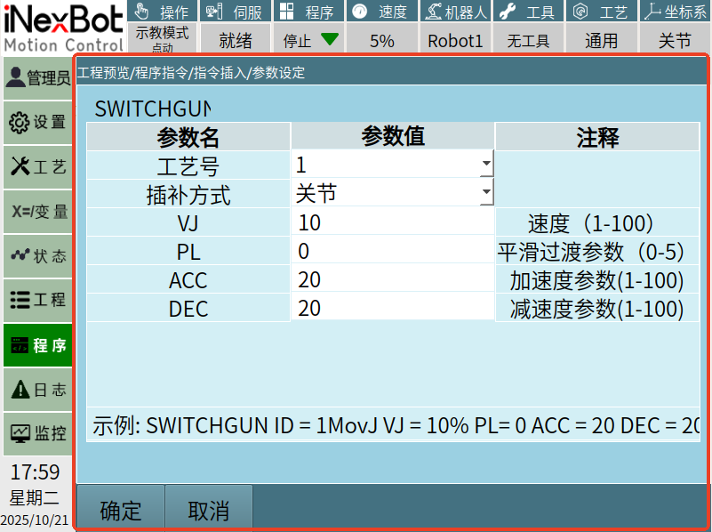
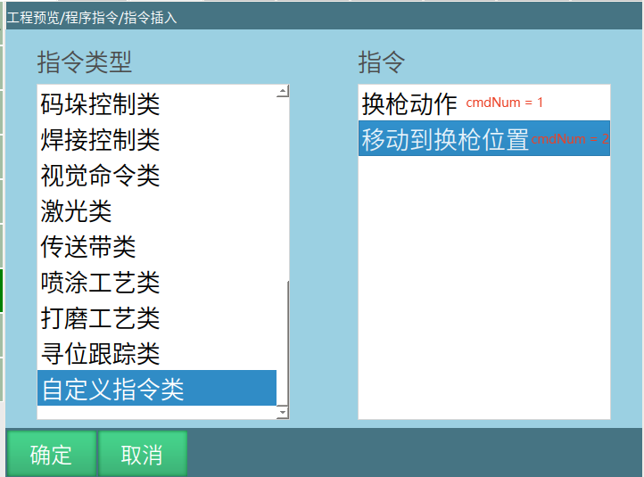

# 接口介绍

以下接口都在示教器的SDK中的头文件中可以找到

# 自定义指令中的信号接口，需要跟槽函数一起使用

```cpp
/**
 * @brief 调用插入自定义指令界面的信号
 * @note 信号用于初始化自定义界面，即作业文件指令插入时显示的界面
 * @param cmdNum 其编号，对应插入时自定义指令类中从上到下第几个
 */
void signal_userdefine_cmd_init(int cmdNum);
/**
 * @brief 调用修改自定义指令界面的信号
 * @note 信号用于修改自定义指令，即作业文件指令修改时显示的界面
 * @param cmdNum 编号，对应插入时自定义指令类中从上到下第几个
 * @param cmdParam 插入时传入的字符串参数，用于显示当前字符串参数
 * @param posName 插入时传入的点位名，可选用
*/
void signal_userdefine_cmd_alter(int cmdNum, QString cmdParam, QString posName);
```
## signal_userdefine_cmd_init：用于打开用户自己写的自定义指令界面，如下图为自定义的界面：



cmdNum参数：在指令插入界面的自定义指令类内从上到下的第几个：



## signal_userdefine_cmd_alter：用于修改已经插入到作业文件中的自定义指令，调用后同样会打开用户自己写的自定义指令的界面


cmdNum参数：需要修改的是哪一条自定义指令，具体哪一条指令按照下图去分辨：


# 自定义指令接口

```cpp
/**
 * @brief 插入自定义指令
 * @param cmdNum 编号，对应插入时自定义指令类中从上到下第几个
 * @param cmdParam 传入的自定义字符串参数
 */
void userdefine_cmd_insert(int cmdNum, QString cmdParam);
/**
 * @brief 修改自定义指令显示在插入界面的名称
 * @param EnglishName 英文名称
 * @param ChineseName 中文名称
 * @note 插入的数量决定自定义指令的个数
 * @note 请在使用connect调用信号signal_userdefine_cmd_init(int)绑定界面后调用此参数，否则会失效
 */
void userdefined_cmd_name_change(QStringList &EnglishName,QStringList &ChineseName);
/**
 * @brief 关闭自定义指令界面
 * @note 插入和修改自定义点位需要取消时，请调用此接口以确保系统正确处理标志位
 */
void close_userdefine_cmd_widget(QWidget *);
```
## userdefined_cmd_name_change：使用示例

```cpp
QStringList ENname ;
ENname <<"SWITCHGUN"<<"SWITCHGUNPOS";

QStringList CNname;
CNname << tr("换枪动作")<<tr("移动到换枪位置");
Nextp::getInstance()->userdefined_cmd_name_change(ENname, CNname);
```

