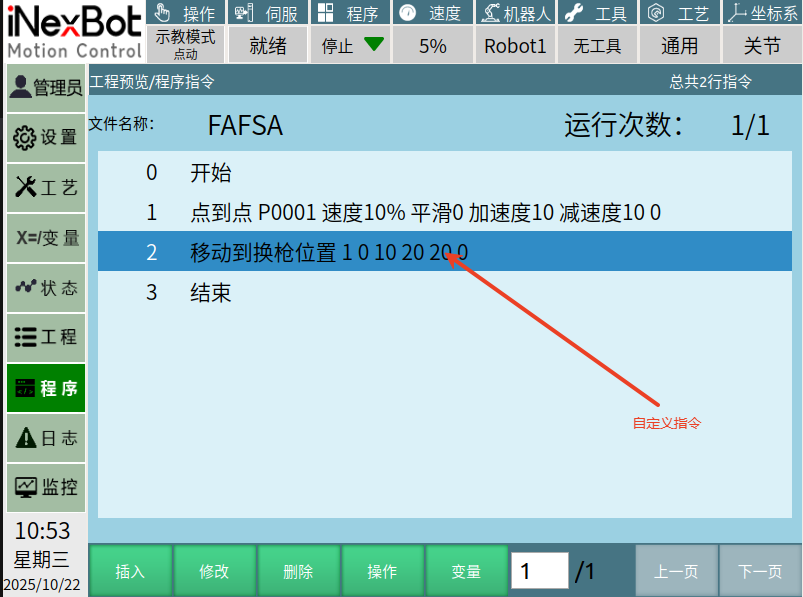
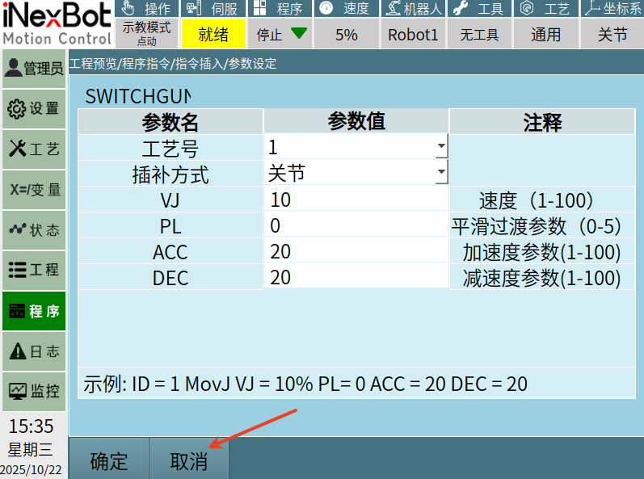

# 示教器自定义指令使用示例

# 本文档只适用于有QT开发基础的用户

本文主要围绕相关下载内的示教器二次开发demo进行教学，需要结合demo中的代码一起看

## 1，自定义指令界面

用户可以按照自己的喜好自己设计指令的界面，也可以直接使用我们的模板界面，下图是demo中设计好的一个界面示例（用户可以直接用这个示例进行修改或者复制添加新的界面）


## 2，设置指令插入界面的自定义指令类中的指令

主要使用的接口：

userdefined_cmd_name_change：修改自定义指令显示在插入界面的名称，效果如下图：

```
QStringList ENname ;
ENname <<"SWITCHGUN"<<"SWITCHGUNPOS";
QStringList CNname;
CNname << tr("换枪动作")<<tr("移动到换枪位置");
Nextp::getInstance()->userdefined_cmd_name_change(ENname, CNname);
```


## 3，打开自定义指令界面

主要使用到的接口是：

signal_userdefine_cmd_init ：该函数是qt中的一个信号函数，需要跟槽函数连接使用，用于打开用户自己写的自定义指令界面

```cpp
connect(Nextp::getInstance(),SIGNAL(signal_userdefine_cmd_init(int)),this,SLOT(slot_userdefine_cmd_init(int)));


void WidgetManager::slot_userdefine_cmd_init(int cmd_num)    //cmd_num对应指令插入界面自上而下的顺序
{
    if(cmd_num == 1)                                        //对应界面中的换枪动作指令
    {
    }
    if(cmd_num == 2)                                       //对应界面中的移动到换枪位置指令
    {
        //设置二次开发界面在窗口中的位置，并且打开该界面
        Nextp::getInstance()->setWidgetParentLocation((QWidget *)SwitchGunPosCommand::getInstance(), 86, 96);//设置界面的打开的位置
        SwitchGunPosCommand::getInstance()->initSwitchGunPosCmd();
        SwitchGunPosCommand::getInstance()->raise();
        SwitchGunPosCommand::getInstance()->show();     //打开界面
    }
}
```
Ps：SwitchGunPosCommand是我们第一步的自定义指令界面

## 4，插入自定义指令

自定义指令界面当中的确定控件的点击事件绑定了slot_cmdInsertEnsureClicked槽函数：

SwitchGunPosBtnEnsure为确定控件的名称

```cpp
connect(ui->SwitchGunPosBtnEnsure, SIGNAL(clicked()), this, SLOT(slot_cmdInsertEnsureClicked()));

void SwitchGunPosCommand::slot_cmdInsertEnsureClicked()
{
    int ID = ui->m_pcomboBoxGP_ID->currentIndex()+1;
    int moveType = ui->m_pcomboBoxGP_TYPE->currentIndex();
    double vel = ui->m_pLineEditSwitchGP_V->text().toDouble();
    double acc = ui->m_pLineEditSwitchGP_ACC->text().toDouble();
    double dec = ui->m_pLineEditSwitchGP_DEC->text().toDouble();
    int pl = ui->m_pLineEditSwitchGP_PL->text().toInt();
    QString Param = "移动到换枪位置 " + QString::number(ID) + " " + QString::number(moveType) + " " + QString::number(vel) +         " " + QString::number(acc)
             + " " + QString::number(dec) + " " + QString::number(pl);    //封装需要发送的参数
    Nextp::getInstance()->userdefine_cmd_insert(2,Param);  // 2：自定义指令的编号，对应控制器回调函数的第一个int形参
    this->hide();      //指令插入后关闭自定义界面
}
```
将界面当中需要发送给控制器的参数封装成字符串类型，然后通过userdefine_cmd_insert接口将指令插入到作业文件当中



## 5，修改自定义指令

当自定义指令已经插入到作业文件当中后还需要修改指令当中的参数

主要使用到的接口：

signal_userdefine_cmd_alter：调用修改自定义指令界面的信号函数

```cpp
connect(Nextp::getInstance(),SIGNAL(signal_userdefine_cmd_alter(int,QString,QString)),this,SLOT(slot_userdefine_cmd_alter(int,QString,QString)));      //当光标选中自定义指令并点击修改控件的时候就会触发这个槽函数


void WidgetManager::slot_userdefine_cmd_alter(int cmd_num, QString cmd_param, QString pos_name)
{
    if(cmd_num == 1)                                        //对应界面中的换枪动作指令
    {
    }
    if(cmd_num == 2)                                       //对应界面中的移动到换枪位置指令
    {
        //设置二次开发界面在窗口中的位置，并且打开该界面
        Nextp::getInstance()->setWidgetParentLocation((QWidget *)SwitchGunPosCommand::getInstance(), 86, 96);//设置界面的打开的位置
        SwitchGunPosCommand::getInstance()->initSwitchGunPosCmd();
        SwitchGunPosCommand::getInstance()->raise();
        SwitchGunPosCommand::getInstance()->show();     //打开界面
    }
}
```
## 6，关闭自定义指令界面

当用户打开了自定义指令界面后又不想插入指令时，可以直接关闭这个界面，就可以回到上一级的界面

在界面当中创建一个返回或者取消的控件，将这个控件绑定一个关闭界面的槽函数即可

SwitchGunPosBtnCancel为demo中的自定义指令界面的取消控件，示例如下：

```cpp
connect(ui->SwitchGunPosBtnCancel, SIGNAL(clicked()), this, SLOT(slot_cmdInsertCancelClicked()));

void SwitchGunPosCommand::slot_cmdInsertCancelClicked()
{
    this->close();
}
```

