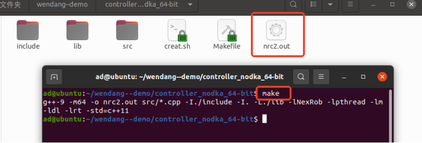

# 快速开始

## 1. 环境安装

### 1.1 系统要求

当前推荐的开发环境操作系统为：

当前支持的 Qt 编译套件包括：

- Ubuntu 20.04
- Desktop Qt 5.9.0 GCC 64 bit
- LYX（示教盒嵌入式编译套件）

需要根据不同的目标平台，选择不同的 Qt 编译套件。

如果只需要在 Ubuntu 20.04 上运行，选择 Desktop Qt 5.9.0 GCC 64 bit 编译套件，如果需要在嵌入式示教盒上运行，选择 LYX 编译套件。

我们提供打包了所有开发环境的镜像文件，当然也可以在任意一台 Ubuntu 20.04 下参照小节《1.3 编译套件安装》来安装。

> 直接获取安装好了的虚拟机
> 点击这里 可以下载得到配置好开发环境的、基于VirtualBox软件使用的Ubuntu 20.04.1 系统的虚拟机;
> 点击这里 可以下载得到基于Windows系统的VirtualBox软件安装包，如需其他系统版本的请自行到 VirtualBox官网 进行下载。
> •
> 安装VirtualBox软件（注意按转路径不能带有中文）
> •
> 打开下载的"开发环境虚拟机"文件夹，按照"README.txt"文件说明安装虚拟机;
> •
> 开机后登录账户"nbt"，密码是"123"。

### 1.2 Qt 下载

我们需要进入Qt的官网 Qt Downloads 选择 qt-opensource-linux-x64-5.9.0.run 下载。

> 推荐复制这个链接 https://download.qt.io/new_archive/qt/5.9/5.9.0/qt-opensource-linux-x64-5.9.0.run，打开迅雷下载速度更快。

下载完成后在Ubuntu 20.04中，打开cmd，运行：

```bash
sudo chmod a+x qt-opensource-linux-x64-5.9.0.run
sudo ./qt-opensource-linux-x64-5.9.0.run
```

出现qt安装程序后⼀直选择默认，直到这⼀步需要勾选如图所⽰的选项：



步骤全部完成后，Qt会被安装到/opt目录下。

启动Qt，运行：

```text
/opt/Qt5.9.0/Tools/QtCreator/bin/qtcreator
```

### 1.3 编译套件安装

以下编译链根据具体的目标平台选择安装：

#### 1.3.1 Desktop Qt 5.9.0 GCC 64 bit 编译套件安装

安装GCC，运行：

```bash
sudo apt install gcc-multilib
sudo apt install g++-multilib
sudo apt install lib32z1
sudo apt install libgl1-mesa-dev
```

#### 1.3.2 LYX 编译套件安装

将gcc.tar.gz和qtenv.tar.gz解压到系统的/opt/⽬录下

```bash
sudo tar -zxvf gcc.tar.gz -C /opt
sudo tar -zxvf qtenv.tar.gz -C /opt
```

将tslib.tar.gz解压到系统的/usr/local⽬录下

```bash
sudo tar -zxvf tslib.tar.gz -C /usr/local
```

配置32位编译环境

```bash
sudo dpkg --add-architecture i386
sudo apt update
sudo apt install libc6-dev-i386
sudo apt install g++-multilib
sudo apt install libstdc++6:i386
```

打开qt，添加 LYX 编译套件，详细步骤可⻅附件：


至此，我们常用的两个编译套件就配置完成了。

## 2. 远程登陆到示教器

### 2.1 确认电脑连接上示教器

首先确保你的电脑已经跟控制器连接了通讯，电脑的IP需要跟控制器的IP在同一网段下。示教器的出厂默认IP为192.168.1.245，所以电脑连接控制器的网口同样需要设置为1网段（比如可以设置192.168.1.110）。设置完成之后在Ubuntu中打开一个新的终端输入

```bash
ping 192.168.1.245
```

如出现不成功的情况，请检查网线的连接，电脑的IP，示教器的IP。

### 2.2 使用ssh登陆到示教器

```bash
ssh root@192.168.1.245
```

然后密码输入1234，即可进行远程控制了。

示教器程序执行在/userfs/app/下，使用./Qt-tp -qws即可启动示教器程序，使用killall -9 Qt-tp杀死示教器程序。
